# シンボリック実行の技術調査
多くのセキュリティおよびソフトウェアテストアプリケーションでは，プログラムの特定のプロパティが，使用可能なシナリオに対して担保されているどうかを確認する必要があります．例えば，ソフトウェアの脆弱性を識別するツールは，プログラムの認証をバイパスするためのバックドアを排除する必要があるでしょう．1つのアプローチは，異なるランダム入力を使用してプログラムをテストすることです．バックドアは限られた特定のプログラムのワークロードのためにしか当てることができないため，可能な範囲で入力の自動探査が本質的です．シンボリック実行は，具体的な入力を必ずしも必要とせずに，同時に多くの可能な実行経路を体系的に探索することによって，問題に対する洗練された解決策を提供します．完全に指定された入力値を使用するのではなく，プロパティ違反の原因となる実際のインスタンスを構築するために制約ソルバーを使用して抽象的にシンボルとして表現します．シンボリック実行は，過去40年間に開発された数十のツールがあり，多数の著名なソフトウェア信頼性アプリケーションで大きく活躍しています．この調査の目標は，開発された主なアイデア，課題，ソリューションの概要を幅広い層の人々のためにそれらを提供することです．

# 1 導入
シンボリック実行は，侵害されるかどうかをテストするために，1970年代半ばに一部のソフトウェアに導入された一般的なプログラム分析手法です[16，58，67，68]．関心のある側面は，ゼロによる除算が実行されず，NULLポインタが参照解除されず，認証をバイパスできるバックドアが存在しないことなどがあります．一般的に，いくつかのプロパティ(ターゲットの間接ジャンプなど)を決める自動化された方法はありません．ヒューリスティックおよび近似解析は，ミッションクリティカルおよびセキュリティアプリケーションを含むさまざまな設定で実際に役立ちます．  
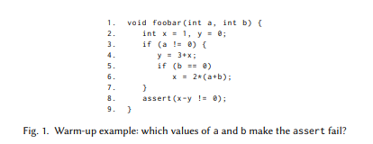  

コンクリート実行では，プログラムが特定の入力で実行され，単一の制御フローパスが探索されます．したがって，ほとんどの場合，コンクリート実行は関心のある特定下でのみ過少近似することができます．対照的に，シンボリック実行は，プログラムが異なる入力の下で取ることができる複数の経路を同時に探索することができます．これにより，検査されたプロパティに対して強力な保証が得られる確実な解析の道が開けます．重要なアイデアは，プログラムが記号的ではなく具体的な入力値を取ることができるようにすることです．実行は，探索された各制御フローパスに対して維持されるシンボリック実行エンジン，すなわち，(i)その経路に沿って分岐が満たす条件を記述する一次ブール式，および(ii)マップするシンボルメモリストアによって実行される変数を記号式または値に変換する．分岐の実行は数式を更新し，割り当てはシンボリックストアを更新します．最終的には，Satisfiability Modulo Theories(SMT)ソルバー[13]に基づいたモデルチェッカーが，探索された各経路に沿ってプロパティの違反が存在するかどうか，および経路自体が実現可能かどうか，例えば，プログラムのシンボリック引数に具体的な値を割り当てることによって式が満たされます．

DARPAが，2013年に脆弱性の検出，利用，パッチ適用のための自動システムをほぼリアルタイムで作成しようとする競争であるCyber Grand Challenge [95]を発表して以来2年間，シンボリック実行技術が異種の視聴者に注目されています．より顕著なことに，2008年以来，多くのMicrosoftアプリケーションのテストプロセスでは，シンボリック実行ツールは24/7で実行されており，Windows 7の開発中にファイルファジングによって発見されたすべてのバグの内ほぼ30％はほかのプログラム解析とブラックボックステスト技術が見逃していました[53]．

この記事では，シンボリック実行の主な側面について調査し，ソフトウェアテストやコンピュータセキュリティアプリケーションなどで採用されている最も顕著な技術について説明します．シンボリック・エンジンは，プログラムのメイン・エントリー・ポイントからの探索を同時に開始する多くの経路を分析するフォワード・シンボリック実行に焦点を当てています．この記事の残りの部分で取り上げている基本的な問題の多くを強調する簡単な例から始めます．

## 1.1 ウォームアップの例題
図1のCコードを考えて，どの入力が関数foobarの8行目のアサーションを失敗させるのかを判断することを想定していると仮定します．各4バイト入力パラメータは2^32個の別個の整数値を取ることができるので，ランダムに生成された入力に対してfoobar関数を具体的に実行するアプローチは，アサート失敗入力を正確に拾うことはまずありません．シンボリック実行は，具体的な値ではなく，その入力の記号を使用してコードを評価することによって，この制限を克服し，単一の入力値ではなくクラスの入力をすることを可能にします．より詳細には，関数の実際のパラメータやストリームからデータを読み込むシステムコールの結果など，コードの静的解析では判断できないすべての値は，記号α_iで表されます．いつでもシンボリック実行エンジンは状態(stmt，σ，π)を維持します．  
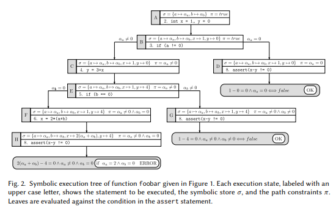  
- stmtは評価する次の文です．当面は，stmtは代入，条件分岐，ジャンプ(関数呼び出しやループなどのより複雑な構文については第5章で説明します)とすることができます．
- σは，プログラム変数を具体値または記号値α_iのいずれかと関連付けるシンボリックストアです．
- πは経路制約を示し，すなわち，実行中にstmtに達するために取られた記号α_iによる分岐の仮定セットを表す式です．分析の開始時には，π = tureです．

stmtに応じて，シンボリックエンジンは次のように状態を変更します．
- 代入x = eの評価は，xを新しい記号表現e_sに関連付けることによってシンボリックストアσを更新します．この関連付けをx→e_sと表記します．ここで，e_sは現在の実行状態のコンテキストでeを評価することによって得られ，記号や具体的な値に対する単項演算子または二項演算子を含む式です．
- if e s_true else s_falseならば条件分岐の評価は経路制約πに影響します．シンボリック実行は，π_true = π ∧ e_sとπ_false = π ∧ ¬e_sの2つの分岐にそれぞれ対応する経路制約π_trueとπ_falseを持つ2つの実行状態を作成することによって分岐されます．ここで，e_sはeを評価することによって得られる記号式です．シンボリック実行は，両方の状態で独立して実行されます．
- ジャンプの評価は，シンボリック実行を文sにgotoすることによって実行状態を更新します．

ツリーとして効果的に表現できる関数foobarのシンボリック実行を図2に示します．最初は(実行状態A)，経路制約は真であり，入力引数aとbは記号値に関連付けられています．2行目でローカル変数xとyを初期化した後，シンボリックストアは，それぞれxとyを具体的な値1と0(実行状態B)に関連付けることによって更新されます．3行目は条件分岐を含み，実行はforkされます．実行された分岐に応じて，次に異なる文が評価され，シンボルα_a(実行ステートCおよびD)ごとに異なる仮定が実行されます．α_a != 0の分岐では，変数yにx + 3が代入され，状態Cではx→1であるため，状態Eでy→4を得ます．

一般に，算術式評価は単純に記号値を操作します．すべての分岐で8行目のアサーションに達するまですべての実行ステートを拡張後，パラメータaおよびbのどの入力値がアサートを失敗させるかを検査することができます．実行状態{D，G，H}を解析することによって，Hのみがx - y = 0を真とすることができると結論付けることができます．この時点でのHの経路制約は，foobarにとって安全でない入力セットを暗黙的に定義します． 特に，次のような入力値があります．2(α_a + α_b) - 4 = 0 ∧ α_a，0 ∧ α_b= 0アサートが失敗するでしょう．安全ではない入力パラメータのインスタンスは，経路制約を解決するSMTソルバー[13]を呼び出すことによって最終的に決定できます．この例ではa = 2とb = 0が得られます．

### 1.2 シンボリック実行の課題
セクション1.1で説明した例では，シンボリック実行は，アサートを失敗させる可能性のあるすべての安全でない入力を識別できます．これは，可能な実行状態の網羅的探索によって達成されます．理論的な観点から，網羅的なシンボリック実行は，決定的な分析のための確実かつ完全な方法論を提供します．確実性は偽陰性を防止します．つまり，可能性のあるすべての安全でない入力が検出されることが保証されます．一方，完全性は偽陽性を防止します．つまり，安全でないとみなされる入力値は実際には危険です．後で説明するように，徹底的なシンボリック実行は，小規模なアプリケーションを超えて拡張することは難しいでしょう．したがって，実際には，パフォーマンスと確実性のトレードオフになるなど，あまり大がかりなものではない目標に合わせることがよくあります．実際のコードを処理するときに，ウォーミングアップの例に示されているものよりもはるかに複雑なものになる可能性があるというシンボリック実行が直面する課題があります．自然にいくつかの観察と質問が発生します．  
- メモリ：シンボリックエンジンは，ポインタ，配列，その他の複雑なオブジェクトをどのように扱いますか？コードを操作するポインタとデータ構造は，シンボリックに格納されたデータだけでなく，シンボリック式で記述されたアドレスもそうです．
- 環境：エンジンは，ソフトウェアスタック全体でどのように対話的に処理しますか？ライブラリおよびシステムコードを呼び出すと，後に実行に影響を及ぼし，説明されなければならないファイルや呼び出しをユーザコードに戻すなどの副作用が生じる可能性があります．しかし，可能性のある対話的の結果を評価することは不可能かもしれません．
- 状態空間の爆発：シンボリック実行は経路爆発をどう扱うのか？ループなどの言語構成では，実行状態の数が指数関数的に増加することがあります．したがって，シンボリック実行エンジンが妥当な時間内にすべての可能な状態を網羅的に探索することはありそうにないです．
- 制約の解法：実際に制約ソルバーは何ができますか？SMTソルバは，数百もの変数にわたる複雑な制約条件の組み合わせに対応できます．しかしながら，非線形算術のような構成は，効率の大きな障害となります．

シンボリック実行が使用される特定のコンテキストに応じて，上で強調表示された質問に対処するためのさまざまな選択肢と前提があります．これらの選択は，通常，確実性または完全性に影響を及ぼしますが，いくつかのシナリオでは，可能な実行状態の空間の部分的探索が，限られた時間内で目標を達成するのに十分でありえます(例えば，アプリケーションのクラッシュ入力を識別するなど)  
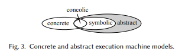  

### 1.3 最近の動向
シンボリック実行は膨大な文献の焦点をあてています．2017年8月現在，Google Scholarはタイトルに正確なフレーズ"シンボリック実行"を含む記事を742件報告しています．この調査に先立って，[79]や[22]のような分野の技術概要を他の著者が寄稿しています．[28]は，自動テスト生成のより具体的な設定に焦点を当てています．文献の包括的な見方を提供し，さまざまなテクニックを深く網羅し，多数の実行例を使って技術的な議論を補完します．

### 1.4 記事の構成
この記事の残りは次のように構成されています．第2章では，シンボリック実行エンジンの全体的な原則と評価戦略について説明します．第3章から第6章では，第1.2節に挙げた重要な課題に取り組み，第7章では，シンボリック実行技術を強化するために他の分野における最近の進歩をどのように適用できるかについて説明します．結論は第8章で述べます．  

## 2 シンボリック実行エンジン
この章では，シンボリック実行の設計とその実装で発生する重大なトレードオフのためのいくつかの重要な原則について説明します．具体的，記号的な実行のコンセプトから，コンクリック実行の考え方も紹介します．

### 2.1 シンボリックとコンクリートを合わせた実行
ウォームアップの例(第1.1節)に示すように，プログラムのシンボリック実行は，特定の入力に対するコンクリート実行中にプログラムが取ることができるすべての可能な制御フロー経路を理論上生成することができます．可能なすべての実行をモデリングすると非常に興味深い分析が可能ですが，実際には実用的ではありません．特に実世界のソフトウェアでは実現できません

古典的なシンボリック実行の主な制限は，対処できない経路制約による実行可能なものを探索することができないことである[22]．確実性の喪失は，エグゼキュータによってトレースできない外部コードだけでなく，例えば非線形演算または超越関数を含む複雑な制約から生じます．制約解決に費やされる時間がエンジンの主要な性能障壁であるため，解決性は絶対的な意味で検出することもできますが，効率もそうです．実用的なプログラムは，通常，自己完結型ではありません．実行中の可能性のある副作用を正確に評価することが難しいため，ソフトウェアスタック全体を静的に解析できるシンボリックエンジンを実装することは困難です．これらの問題に対処し，実際にシンボリック実行を可能にするための基本的な考え方は，コンクリートとシンボリック実行を混ぜ合わせることです：これはコンクリック実行といわれ，"concrete"と"symbolic"が合わさった言葉です．この一般的な原理は，このセクションの残りの部分で説明するように，さまざまな角度に沿って検討されています．

動的シンボリック実行．動的シンボリック実行(DSE)または動的テスト生成[51]として知られている一般的なコンクリック実行アプローチの1つは，具体的な実行がシンボリック実行を動かすことです．この手法は，上記の問題を緩和するのに非常に有効です．シンボリックストアと経路制約に加えて，実行エンジンは具体的なストアσ_cを保持します．まず，任意の入力を選択後，2つのストアと経路制約を同時に更新することにより，プログラムを具体的にも記号的にも実行します．コンクリート実行が分岐をとるときはいつでも，シンボリック実行は同じ分岐に向けられ，分岐の条件から抽出された制約は現在の経路制約セットに追加されます．

要するに，シンボリック実行は特定のコンクリート実行によって動きます．結果として，シンボリックエンジンは，分岐条件が充足可能(充足不可能)かどうかを判断するために制約ソルバを呼び出す必要はありません．これは，具体的な実行によって直接テストされます．異なる経路を探索するために，1つまたは複数のブランチによって与えられる経路条件を否定することができ，SMTソルバが呼び出されて，新しい制約のための満たす割り当てを見つけます，つまり新しい入力を生成します．この戦略は，必要な範囲を達成するために必要なだけ繰り返すことができます．  
>> 例．図1のC関数を考え，入力パラメータとしてa = 1とb = 1を選択すると仮定します．これらの条件下では，コンクリート実行に経路A; B; C; E; Gを図2のシンボリックツリーに配置し使用します．図2に示すシンボリックストア以外にも，トラバース状態で維持されるコンクリートストアは次のとおりです．  
 σ_c = {a → 1， b → 1} in state A;  
 σ_c = {a → 1， b → 1， x → 1， y → 0} in states B and C;  
 σ_c = {a → 1， b → 1， x → 1， y → 4} in states E and G.  
8行目のアサート条件が成功したことを確認した後，最後の経路制約，すなわちα_b，0を否定することによって，新しい制御フローパスを生成することができます．この時点のソルバーは，制約α_a，0 ∧ α_b= 0を満たす新しい入力(例えば，a = 1およびb = 0)を生成し，実行は経路A → B → C → E → Fに沿って同様の方法で継続します．  

DSEは具体的な入力を使用して特定の経路に向かってシンボリック実行を動かしますが，新しい経路を探さなければならないときは常にブランチを選択して否定する必要があります．また，それぞれのコンクリート実行によって，新しい分岐が追加される可能性があります．実行されたすべてのコンクリート実行に渡って，使われない分岐のセットが非常に大きくなる可能性があるため，効果的な検索ヒューリスティック(セクション2.2)を採用することが重要な役割を果たします．たとえば，DART [51]は，深さ優先戦略を使用して否定する次の分岐を選択します．次の分岐を選択して無効にするための追加の戦略が文献に示されています．たとえば，SAGE [52]の世代検索(generational search)では，状態空間を部分的に探索し，生成された新しいテストの数を最大化し，検索の重複を回避します．これは，特定の順序に従う否定する制約を無効にし，検索アルゴリズムのバックトラッキングを制限することによって実現されます．状態空間は部分的にしか探索されていないため，初期入力は全体的アプローチの有効性において重要な役割を果たします．初期入力の重要性は，伝統的なブラックボックスファジングで起こるものに似ています．したがって，SAGEなどのシンボリックエンジンは，しばしばホワイトボックスファザーと呼ばれます．

コンクリート実行中に維持されるシンボリック情報は，エンジンによって利用され，新しい入力を取得し，新しい経路を探索することができます．次の例は，DSEがコンクリックエンジンによってシンボリックに追跡されていない外部コードへの呼び出しを処理する方法を示しています．制約の解決を支援するための具体的な値の使用については，第6章で説明します．

>> 例．図4aの関数fooを考え，barがコンシリックエンジンによって記号的に追跡されないと仮定します(例えば，サードパーティのコンポーネントによって提供されたり，別の言語で書かれたり，ブラックボックスアプローチに従って分析されたりします)．コンクリックエンジンは，x = 1とy = 2が無作為に入力パラメータとして選択されたと仮定すると，bar(a = 0を返します)を実行し，エラー文をトリガする分岐をスキップします．同時に，シンボリック実行は関数fooの中で経路制約α_y ≥ 0を追跡します．関数barの分岐条件がエンジンに認識されていないことに注意してください．代替経路を探索するために，エンジンはfooの分岐の経路制約を否定し，コンクリート実行を実際に代替経路で動作するx = 1やy = -4などの入力を生成します．この方法では，barが記号的に追跡されていなくてもエンジンはfooの両方の経路を探索できます．  
前のコードの変形が図4bに示されています．ここで，関数quxはfooとは異なり，単一の入力パラメータを取りますが，分岐条件のbarの結果を検査します．しかし，エンジンはqux内でテストされた分岐条件で経路制約を追跡できますが，代替経路に向かって実行できる入力が生成される保証はありません．aとxの関係はコンクリックエンジンには知られていません．barは記号的に追跡されません．この場合，エンジンは異なるランダム入力を使用してコードを再実行することができますが，しかし，結局はquxの1つの興味深い経路を探索することができませんでした．関連する問題が図4cに示されています．予測された経路に対して生成された入力が異なる経路に実行を導くとき，経路の分岐を観察します．一般に，これは，シンボル伝搬が追跡されず，不正確な経路制約，またはエンジン内の特定の(例えば，ビット単位の，浮動小数点)演算のモデリングにおける不正確さに起因する可能性があります．この例では，関数bazは外部関数absを呼び出します．absは絶対値でxに副作用を起こします．最初の具体的な値としてx = 1を選択すると，コンクリート実行はエラーを引き起こしませんが，コンクリックエンジンはbazの分岐によって経路制約のαx ≥ 0を追跡し，新しい入力を否定して生成します．しかし，新しい入力，例えばx = -1は，absの副作用のためにエラーを引き起こしません．興味深いことに，エンジンは，入力が実際にエラーを引き起こさないことを検出する方法がありません．

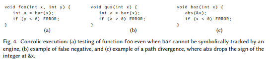  
この例に示すように，偽陰性(すなわち，見逃した経路)および経路の発散は，動的シンボリック実行の顕著な欠点です．DSEは，パフォーマンスと実装の面で確実さとトレードオフです．偽陰性の可能性というのは，プログラムの実行や誤った動作の可能性があるため，見逃すかもしれないといことです．完璧に近づきますが，それはプログラム解析の過少近似におけるものです．文献では経路の相違が頻繁に観察されています．例えば，[52]は60％以上の割合を報告しています．[27]は，この現象に寄与する主要なパターンを分析し，経路の相違についての経験的研究を提示しています．外部呼び出し，例外，型キャスト，シンボリックポインタは，経路の相違の数を減らすためにエンジンによって注意深く処理されなければならないコンクリック実行の重要な側面として特定されています．

選択的シンボリック実行．S2E [29]は，ソフトウェアスタックのいくつかのコンポーネントだけを完全に探索し，他のものを気にする必要がないという観測に基づいて，シンボリックとコンクリートの実行を混在させるために異なるアプローチをとっています．選択的シンボリック実行は，コンクリートとシンボリック実行を注意深くインターリーブし，全体的な探索を意味のあるものにします．関数Aが関数Bを呼び出し，呼び出し地点で実行モードを変更します．このとき，2つのシナリオが発生します：(1)具体的なものから記号的なもの，その裏側：Bの引数は記号的になり，Bは完全に記号的に探索されます．また，Bは具体的に実行され，具体的な結果はAに返されます．その後，Aは具体的に再開する．(2)シンボリックからコンクリート，その裏側：Bの引数が具体化され，Bが具体的に実行され，Aで記号的に実行が再開されます．これは分析の確実性と完全性の両方に影響を与える可能性があります．(i)完全性：シンボリック実行が，実行された具体化のために実現できないパスをスキップします(偽陽性につながる可能性があります)．S2Eは，引数がどのように具体化されているか，Bがどのような副作用をもたらし，どの戻り値を生成するかを追跡する経路制約を収集します．(ii)確実性：Aが再開された後，具体化により分岐を見逃すことがあります(偽陰性につながる可能性があります)．  
これを修正するために，収集された制約はソフトとしてマークされます．Aに戻った後の分岐がソフト制約によって無効になるたびに，実行の後戻りとBの異なる引数の選択が試行されます．Bの引数の再具体化を導くために，S2EはBのコンクリート実行中に分岐条件を収集し，具体的な値を選択して，Bで異なるコンクリート実行経路を可能にします．

### 2.2 経路選択
プログラムのすべてのパスを列挙することは非常に高価(膨大な時間がかかる)になる可能性があるため，テストとデバッグに関連する多くのソフトウェアエンジニアリング活動では，最も有望な経路を最初に調べることによって優先順位が決まります．次の探索経路を選択するためのいくつかの戦略の中で，最も有効なもののいくつかを簡単に概説します．シンボリックエンジンが特定の目標(例えば，オーバーフロー検出)を達成するのを助けるために，経路選択ヒューリスティックがよく調整されることを我々は指摘します．普遍的に最適な戦略を見つけることは未解決の問題です．

未探索の最も深い地点に後戻りする前に可能な限りパスを展開するDepth First Search(DFS)と，すべてのパスを並行して展開するBFS(breadth first search)が最も一般的な戦略です．DFSは，メモリ使用量が重視されているが，ループや再帰呼び出しを含む経路によって妨げられる場合に採用されることがよくあります．したがって，特定のパスの探索を完了するために必要とされるより高いメモリ圧力と長い時間がかかるため，いくつかのツールはBFSに頼っており，興味深い動作を早期に検出する多様なパスを素早く探索できます．もう1つの一般的な戦略は，ランダムパス選択です．これはいくつかのバリエーションで洗練されています．例えば，KLEE [20]は，その長さと分岐点に基づいて経路に確率を割り当てます．これは，より少ない回数で探索された経路を優先し，ループおよび他の経路爆発要因によって引き起こされる飢餓を防止します．

EXE [21]，KLEE [20]，Mayhem [25]，およびS2E [29]のようないくつかの研究では，コードカバー範囲を最大化することを目的としたヒューリスティックについて議論してきました．例えば，KLEE [20]で議論されたカバー範囲最適化探索は，各状態について重みを計算し，後で状態をランダムに選択するために使用されます．重みは，最も近いカバーされていない命令がどれくらい離れているか，最近新しいコードがその状態によって最近カバーされたかどうか，および状態のコールスタックを考慮することによって得られます．似たようなもとして，subpath-guided searchと呼ばれる[71]で提案されたヒューリスティックがあります．探索回数の少ない制御フローグラフのサブパスを選択することで，プログラムの訪れた頻度が少ない部分を探索しようとします．これは，探索された部分経路の頻度分布を維持することによって達成され，部分経路は，完全な経路から長さnの連続した部分列として定義されます．興味深いことに，値nは，このヒューリスティックを使用するシンボリックエンジンによって達成されるコードカバー範囲に関して重要な役割を果たし，特定ではない値は普遍的に最適であると示されています．最短距離シンボリック実行[72]は，カバー範囲を対象としませんが，プログラム内の特定のポイントの実行をトリガするプログラム入力を特定することを目的としています．しかし，ヒューリスティックは，カバー範囲ベースの戦略と同様に，ターゲットポイントまでの最短距離を評価するための基準に基づいています．これは，手順間制御フローグラフにおける最短経路の長さとして計算され，最短距離の経路がエンジンによって優先順位付けされます．

他の探索ヒューリスティックスは，いくつかの目標に従って興味深い状態につながる可能性のある経路の優先順位付けを試みます．例えば，AEG [8]はこのような戦略を2つ導入しています．バギーパスの最初の戦略は，過去の状態で小さいが，悪用できないバグが含まれているパスを選択します．パスにいくつかの小さなエラーが含まれている場合，適切にテストされていない可能性が高いという直感です．したがって，将来の状態には興味深く，うまくいけば悪用可能なバグが含まれている可能性が高いです．同様に，ループ枯渇戦略は，ループが呼ばれる経路を探索する．このアプローチは，ループ内の一般的なプログラミングミスがバッファオーバーフローまたは他のメモリ関連エラーを引き起こす可能性があるという実用的な観察に触発されています．悪用可能なバグを見つけるために，Mayhem [25]は代わりに，シンボリックアドレスへのメモリアクセスが識別されるか，シンボリック命令ポインタが検出されるパスを優先します．

Finite State Machine(FSM)が表すことができるプロパティ(ファイル使用またはメモリ安全性など)を満たすプログラム経路を自動的に見つける動的シンボリック実行の新しい方法を提案しています[118]．動的シンボリック実行は，プロパティを満たす可能性が最も高い実行経路の分岐を最初に調べるように，FSMによってガイドされます．このアプローチは，探索のために選択される経路の優先度を計算するために静的解析と動的解析の両方を利用します．現在の実行経路が既に到達しているFSMの状態は，シンボリック実行中に動的に計算され，逆方向のデータフロー解析で将来の状態を静的に計算します．これらの2つのセットの共通部分が空でない場合，そのプロパティを満たすパスが存在する可能性があります．

フィットネス関数は，検索ベースのテスト生成[76]の文脈で主に使用されてきました．フィットネス関数は，探索された経路が目標テストカバー範囲にどれだけ近づけるかを測定します．いくつかの研究，例えば，[22，112]は，シンボリック実行の文脈でこのアイデアを適用しています．一例として，[112]は，特定の分岐を近づける可能性の高いパスを優先順位付けするコンクリック実行の分岐を反転するための戦略であるフィットネスを導入しています．より詳細には，| a - c | == 0，経路の近さは| a - c |として計算されます．その経路の変数aとcの具体的な値を利用することによって，他の種類の分岐条件についても同様のフィットネス値を計算することができます．分岐のフィットネス値が最も低い経路は，シンボリックエンジンによって選択されます．分岐にまだ到達していないパスは，最悪の場合のフィットネス値を取得します．

### 2.3 シンボリックバックワード実行
シンボリックバックワード実行(SBE)[26，40]は，探索がターゲットポイントからプログラムのエントリーポイントに進むシンボリック実行の変形です．このように，解析は正準(前方)のシンボリック実行とは逆の方向に実行されます．このアプローチの主な目的は，通常，特定のコード行(例えば，アサートまたはスローの文)の実行をトリガーすることができるテスト入力インスタンスを識別することです．これは，プログラムのデバッグや回帰テストを行う際に，開発者にとって非常に便利です．探索がターゲットから始まると，トラバーサル中に分岐に沿って経路制約が収集されます．SBEエンジンは，一度に複数の経路を調べることができます．(前方)シンボリック実行と同様に，経路は定期的に実行可能性が検査されます．経路条件が満たされないことが判明した場合，エンジンは経路を破棄して後戻りします．

[72]は，SBEと呼ばれるコールチェーンバックワードシンボリック実行(CCBSE)の変種について論じています．このテクニックは，対象の行がある関数内の有効な経路を判断することから始まります．経路が見つかると，エンジンはターゲットポイントを含む関数のコールサイトの1つに移動し，コールサイトのエントリポイントからターゲットポイントまでの有効なパスを再構築しようとします．このプロセスは，プログラムの主機能からの有効なパスが再構築されるまで再帰的に繰り返されます．伝統的なSBEとの主な違いは，CCBSEは目標点から後方にコールチェーンをたどっていますが，各機能の内部では従来のシンボリック実行と同様に探索が行われることです．

SBEおよびCCBSEにおける逆探査の重要な要件は，プログラム全体の制御フローを提供する手順間制御フローグラフの利用可能性であり，探索に関与する関数のコールサイトを決定することができます．残念なことに，このようなグラフを構築することは，実際には非常に困難です．さらに，関数には多くの可能なコールサイトが存在するため，SBEによって実行される探索は依然として非常に高価になります．一方，制約が逆方向に集められた場合，いくつかの実用上の利点が生じる可能性があります．これらの利点については，第6章でさらに検討します．

### 2.4 シンボリックエグゼキュータの設計原則
シンボリック実行エンジンが従うべきパフォーマンス関連の設計原則の多くは，[25]に要約されています．最も顕著なのは：  
(1)進捗状況：実行者は，指定されたリソースを超過することなく，任意の時間を進めることができます．潜在的に膨大な数の鮮明な制御フローパスのために，メモリ消費は特に重要になるでしょう．  
(2)作業の繰り返し：共通の接頭辞を持つ可能性のある異なるパスを分析するために，最初から数回プログラムを再起動することを避け，実行作業を繰り返えさない必要があります．  
(3)解析の再利用：過去の解析結果を可能な限り再利用する必要があります．特に，以前に解決された経路制約に対するSMTソルバーへの高価な呼び出しは避けなければなりません．  

分析される実行状態空間のサイズが大きいため，異なるシンボリック・エンジンは，例えば実行時間とメモリ消費との間の異なるトレードオフ，または分析の性能および確実性/完全性を探究しています．  
オンラインとも呼ばれる単一の実行で複数のパスを同時に実行しようとするシンボリック実行者は，各入力に依存する分岐で実行状態をクローンします．例はKLEE [20]，AEG [8]，S2E [29]に示されています．これらのエンジンは，以前の命令を再実行することはないため，作業の繰り返しは回避されます．しかし，多くのアクティブ状態をメモリに保持する必要があり，メモリ消費量が大きくなり，進捗を妨げる可能性があります．メモリフットプリントを削減するための効果的なテクニックには，さまざまな状態間で可能な限り共有しようとするコピーオンライト(copy-on-write)[20]があります．別の問題として，複数の経路を並行して実行することは，実行状態間の分離，例えばシステムコールの効果をエミュレートすることによってOSの異なる状態を維持することを保証する必要があります．

コンクリック実行のように，一度に単一の経路について推論することは，SAGE [52]のような，いわゆるオフライン実行者によって取られるアプローチです．他の経路とは独立して各経路を実行すると，オンライン実行者に関するメモリ消費量が少なくなり，前回実行した分析結果をすぐに再利用することができます．反対に，各実行は通常，最初からプログラムの実行を再開するため，作業を大幅に繰り返すことになります．オフライン実行者の典型的な実装では，実行は具体的であり，入力シードを必要とします．プログラムは最初に具体的に実行され，命令のトレースが記録され，記録されたトレースがシンボリックに実行されます．Mayhem [25]のような速度とメモリ要件のバランスをとっているハイブリッド実行者は，メモリ使用量や同時にアクティブな状態の数がしきい値に達すると，新しい実行者をフォークするのではなく，オンラインモードで起動し，チェックポイントを生成します．チェックポイントは，シンボリック実行の状態とリプレイ情報を維持します．チェックポイントが復元のために選択されると，復元された具体的な状態からオンライン探索が再開されます．

## 3 メモリモデル
1.1節のウォームアップの例では，データが間接変数なしで格納される単純化されたメモリモデルを示しました．シンボリック実行の重要な側面は，ポインタと配列を持つプログラムをサポートするためにメモリをモデル化する方法です．これには，変数だけでなく，メモリアドレスもシンボリック式や具体的な値にマッピングすることによって，メモリストアの概念を拡張する必要があります．一般に，メモリアドレスを明示的にモデル化するストアσは，メモリアドレス(インデックス)を具体的な値または記号的な表現を介して式に関連付けるマッピングと考えることができます．マッピングでは名前ではなくアドレスを使用して変数をサポートできます．以下では，変数xと式eにx → eを書くとき，&x → eを意味します．ここで，&xは変数xの具体的なアドレスです．また，vが配列であり，cが整数定数である場合，v[c] → eは＆v + c → eを意味する．  
メモリモデルは，シンボリックエンジンにとって重要な設計選択であり，探索によって達成されるカバレッジと制約解決のスケーラビリティに大きく影響する可能性があります[22]．シンボリックメモリアドレス問題[89]は，操作で参照されるアドレスがシンボリック式である場合に発生します．このセクションの残りの部分では，いくつかの一般的な解決策について議論します．  
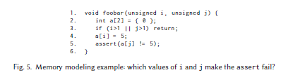  
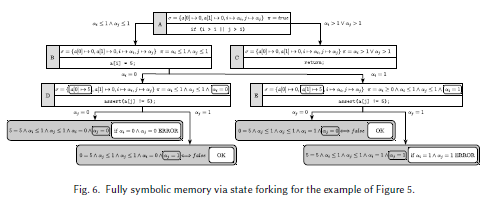  

### 3.1 完全なシンボリックメモリ
最も一般的なレベルでは，エンジンはメモリアドレスを完全な記号として扱います．これは，BitBlaze [98]，[102]，BAP [17]，[103]など，多くの研究で取り上げられているアプローチです．ゼミナール論文[68]でキングによって先駆けられた2つの基本的なアプローチは以下の通りです：  
- 状態フォーク．オペレーションがシンボリック・アドレスからの読み込みまたはシンボリック・アドレスへの書き込みを行う場合，そのオペレーションに起因する可能性のあるすべての状態を考慮して，状態を分岐します．経路制約は，フォークされた各状態に応じて更新されます．
>>例．図5に示すコードを考えてみます．4行目の書き込み操作は，配列インデックスiの未知の値に応じて，a[0]またはa[1]のいずれかに影響します．状態のフォーキングは，両方の可能なシナリオを明示的に考慮するためにメモリ割り当てを実行後に2つの状態を作成します(図6)．フォークされた状態に対する経路制約は，iの値に対する仮定を符号化します．同様に，5行目のメモリ読み出し操作a[j]は，配列インデックスjの未知の値に応じて，a[0]またはa[1]のいずれかにアクセスできます．したがって，代入a[i] = 5の2つの可能な結果のそれぞれについて，対応する状態を分岐することによって明示的に探索されるアサートの2つの可能な結果が存在します．  
- if-then-elseの式．別のアプローチは，シンボリックポインタの可能な値に関する不確実性を，シンボリックストア内および経路制約内に保持された式に，新しい状態をフォーキングすることなく符号化することにあります．重要なアイデアは，ite(c，t，f)という形式のif-then-else式を含む式を推論するソルバーの能力を利用して，cが真であればtを，そうでなければfを生成することです．このアプローチは，メモリの読み書き操作に対して異なる働きをします．αを具体的な値a_1，a_2，...を取るシンボリックアドレスとします．  
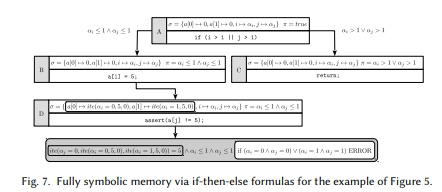  
- αからの読取りは，式ite(α= a_1，σ(a_1)，ite(α= a_2，σ(a_2)，...))を生成します．
- 式eをαに書くと，a1，a2，...のシンボリックストアをσ(a_i) ← ite(α= a_i，e，σ(a_i))として更新します．
どちらの場合も，メモリ操作では，アクセスされたシンボリックアドレスが想定する可能性のある値の数と同じ数のite式がストアに導入されます．シンボリックメモリへのアプローチは，例えばAngr [95] 3.3節)で用いられている．  
>> 例．再び図5に示す例を考えてみましょう．4行目で演算a[i] = 5をフォークするのではなく，if-then-elseアプローチは，割り当ての可能な結果，すなわちa[0] → ite(α_i= 0，5，0)とa[1]→ite(α_i = 1，5，0)(図7)になります．同様に，5行目のa[j]の可能な別個のアドレスごとに新しい状態を作成するのではなく，jの不確実性を1つの式ite(α_j = 0，σ(a[0])，σ(a[1])) = ite(α_j= 0，ite(α_i= 0， 5， 0)，ite(α_i= 1， 5， 0))にします．
広範な研究(例えば，EXE [21]，KLEE [20]，SAGE [43])は，完全なシンボリックポインタをモデル化するために，いくつかのSMTソルバーの表現力を活用します．配列の理論[49]を使用すると，配列演算は，実際には制約式でファーストクラスのエンティティとして表現できます．

汎用性のため，完全なシンボリックメモリは，可能なすべてのメモリ操作を考慮して，プログラムのメモリ動作の最も正確な記述をサポートします．実際の多くのシナリオでは，図5に示す例のように，メモリ操作が参照する可能性のあるアドレスのセットは小さい[98]ですが，インデックスiとjが有限の範囲にあるため，合理的な量のリソースを使用して正確な分析が可能です．しかし，一般に，シンボリックアドレスはメモリ内の任意のセルを参照する可能性があり，可能な状態の数が手に負えないほど爆発してしまいます．このため，スケーラビリティを向上させるためにいくつかのテクニックが設計されています．次の主要なことに沿って詳細に話していきます．  
- コンパクトな形でメモリを表現する．このアプローチは[32]で取り上げられました．これは，シンボリックアドレスではなく具体的なアドレス式をデータにマップし，シンボリックアドレスをコンパクトで暗黙の形式で使用してメモリを参照することによって生じる可能性のある代替状態を表します．問い合わせは，効率的なページングされたインターバルツリーの実装にオフロードされ，どのメモリデータがメモリ読み出し操作によって参照される可能性があるかを決定します．
- パフォーマンスのために確実性を犠牲．このセクションの残りで説明するアイデアは，シンボリックポインタを具体的なアドレスに置き換えることによって実行状態のサブセットへのシンボリック探索を制限することにあります．
- ヒープモデリング．追加のアイデアは，ポインタがNULLであるか，またはどんな一般的なメモリの場所でもなく，以前にヒープに割り当てられたオブジェクトを指すように制限されている状態への探索をすることです(3.2節と3.4節)．

### 3.2 アドレスの具体化
ポインタ値を十分に小さな範囲に限定することができないため，分析の組み合わせの複雑さが爆発するすべての場合において，単一の特定のアドレスへのポインタを具体化するようなことが一般的な選択肢です．これにより，状態数やソルバに入力される数式の複雑さが軽減され，実行時間が改善されます．たとえば，いくつかのポインタの特定の値に依存する経路がエンジンになくなる可能性があります．

具体的には，オフラインエグゼキュータ(2.4節)で具体化が行われます．DART [51]とCUTE [91]の例は，T *型のリファレンスをsizeof(T)バイトの新しく割り当てられたオブジェクトのアドレスに具体化することによってメモリの初期化を処理します．DARTはランダムに選択を行い，CUTEは最初にNULLを試行し，その後の実行では具体的なアドレスを試行します．Tが構造体の場合，同じ具体化手法がポインタオブジェクトのすべてのフィールドに再帰的に適用されます．メモリアドレス(例えば，mallocによって返される)は，異なる具体的な実行において非決定論的に変化することがあるので，CUTEは，シンボリック式の論理アドレスを使用して，異なる実行間の一貫性を維持します．具体的な理由の1つは，制約解決の効率性によるものです．例えば，CUTEの理由は等価グラフを使用するポインタ等価制約のみであり，コストのかかるSMT理論を必要とする，より一般的な制約のための具体化に頼ります．

### 3.3 部分的メモリモデリング
完全なシンボリックメモリのスケーラビリティ問題とメモリの具体化の確実性の損失を軽減するために，Mayhem [25]は部分メモリモデルを導入することで二つの中間点を探究しています．重要なアイデアは，書かれたアドレスが常に具体化され，読み込み可能な値の連続する間隔が十分に小さい場合，読み取りアドレスはシンボリックにモデル化されるということです．このモデルはトレードオフです．これは，状態ごとに複数のポインタ値をエンコードするので，具体化よりも表現力豊かな式を使用しますが，完全なシンボリックメモリのようにそれらをすべてエンコードしようとはしません[7]．アドレスが想定する可能性のある値のセットを制約する基本的なアプローチは，異なる具体的な値を試し，狭い範囲が見つかるまで各試行で大部分のアドレス空間を除いて現在の経路制約を満たすかどうかを検査することです．このアルゴリズムにはいくつかの注意点があります．例えば，各シンボリック逆参照(値の参照)のソルバーへの問い合わせは高価であり，メモリ範囲は連続的ではなく，シンボリックポインタのメモリ領域内の値は構造体を持つ可能性があります．したがって，Mayhemは，範囲を効率的に改良するために，バリューセット分析[42]や問い合わせキャッシングの形式(第6節)など，いくつかの最適化を実行します．もし，プロセスの終わりに範囲サイズが所定の閾値(例えば，1024)を超える場合，アドレスが具体化されます．Angr [95]はまた，部分メモリモデルの考え方を採用し，小さな連続する間隔(最大128アドレス)内にあるシンボリックポインタの書き込み操作をオプションでサポートすることで拡張しています．

### 3.4 遅延初期化
[66]は，C++やJavaで提供されるような高度なオブジェクト指向言語構造のシンボリック実行技術を提案しています．著者は，シンボリック実行とモデル検査を組み合わせて，リストやツリーなどのリンクデータ構造を処理するソフトウェア検証のフレームワークについて説明しています．  
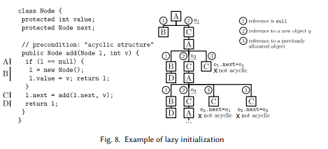  
特に，動的に割り当てられたオブジェクトを効率的に処理するために遅延初期化を導入することによって，シンボリック実行を一般化します．セクション1.1のウォームアップの例と比較すると，状態表現は，そのようなオブジェクトを維持するために使用されるヒープ構成で拡張されています．複雑なオブジェクトを入力として取り込むメソッドのシンボリック実行は，初期化されていないフィールドから始まり，それらに値を遅延ファッションに割り当てます．つまり，実行中に最初にアクセスされたときに初期化されます．  
初期化されていない参照フィールドにアクセスすると，このアルゴリズムは3つの異なるヒープ構成で現在の状態をフォークします．フィールドの初期化としては(1)NULL，(2)すべてのシンボリック属性を持つ新しいオブジェクトへの参照，(3)以前に導入された望んだタイプの具体的なオブジェクトです．

[66，107]は，遅延初期化を，ユーザが提供するメソッドの事前条件，すなわちメソッドの実行前に真であると想定される条件と組み合わせます．事前条件は，メソッドがプログラマが意図したとおりに動作すると予想されるプログラム入力状態を特徴付けるために使用されます．たとえば，バイナリツリーのデータ構造は非循環であり，ルートを除いてすべてのノードで，厳密に1つの親を持ちます．保守的な事前条件は，初期化中に誤ったヒープ構成が削除され，シンボリック実行プロセスが高速化されることを保証するために使用されます．

>> 例．図8は，再帰的なJavaメソッドaddを示しています．これは，ノード型のノードをリンクリストに追加し，遅延初期化を適用するときにそのシンボリック実行の最小表現を追加します．ツリーノードは，addの直線部分の実行を表します．最初に，断片Aは，記号であり初期化されていないlを参照し，評価します．シンボリックエンジンは，(1)lがnull，(2)lが新しいオブジェクトを指す，(3)lが以前に割り当てられたオブジェクトを指し示すという3つのオプションを考慮します．Node型の参照が初めて満たされるので，オプション(3)は除外されます．残りの2つのオプションが展開され，関連するフラグメントが実行されます．フラグメントBを実行後に最初の経路が終了する間，2番目の経路は遅延初期化のため暗黙的に新しいオブジェクトo1を作成し，Cを実行して再帰的にaddを呼び出します．再帰呼び出しを拡張すると，フラグメントAが実行され，エンジンによって3つのオプションが再度検討され，3つの異なる経路に分岐します．ノードオブジェクトが以前に割り当てられた(すなわち，o1)ので，オプション(3)が考慮されます．しかしながら，この経路は，非循環性の事前条件(この例ではコメントとして表現されている)に違反するので，エンジンによってすぐに中止されます．他の分岐した経路はさらに展開され，同じプロセスが繰り返されます．リンクリストには未知の最大長があるため，探索は無限に進むことができます．このため，マテリアライゼーション(すなわち，フィールドインスタンシエーション)チェーンの深さの上限を取ることが一般的です．

最近の領域の進歩は，ヒープ構成の生成効率の向上に重点を置いています．例えば，[38]において，オブジェクトが実際にアクセスされるまで，参照変数の具体化は延期されます．この作業では，遅延初期化の形式化も提供されています．[87]代わりに，すでに具体化されたフィールドからの情報を使用して，興味のないヒープ構成を切り捨てるために境界の改善をし，SATソルバーは，元のアルゴリズムのように命令的ではなく，宣言的であるかどうかを検査するために使用されているが，所定の構成に対して事前条件が保持されています．

## 4 環境との相互作用
ほとんどのプログラムは自己完結型ではないため，シンボリックエンジンは周囲のソフトウェアスタックとの頻繁なやりとりを考慮する必要があります．典型的な例は，基礎をなすオペレーティングシステムの機能(例えば，ファイルシステム，環境変数，ネットワーク)を介して行われるデータフローである．システム環境によって制御される機能は，よく外部を参照します．現代のアプリケーションは，他のコンポーネント(例えば，Swing，Android)を介してユーザと対話したり，実行ランタイムの特別な機能を呼び出す際に，さらなる課題を提起します．これらのソフトウェア要素を介して失われたシンボリックデータフローは，実際に分析の意味に影響を与える可能性があります．  
システム環境．DART [51]，CUTE [91]，およびEXE [21]のような初期の研究では，具体的な引数を使用して実際に外部呼び出しを実行することにより，分析のシステム環境が含まれています．これは，完全なシンボリック戦略と比較して，それらが見ることができる行動を実際に制限し，実行不可能な戦略です．オンライン・エグゼキュータでは，この選択により，実行の別個の経路からの外部呼び出しが相互に干渉する可能性があります．各外部呼び出しの副作用を追跡するためのメカニズムがないため，実行経路がファイルから読み込み，同時に別の実行経路がファイルを削除しようとしているなど，状態の矛盾が発生する可能性があります．

この問題を克服する方法は，これらの相互作用をキャプチャする抽象モデルを作成することです．たとえば，KLEE [20]では，シンボルファイルは，実行状態ごとに基本的なシンボリックファイルシステムでサポートされています．そのシンボリックファイルの数とサイズは，ユーザーによって指定されたn個のシンボリックファイルからなります．シンボリック・ファイルに対する操作は，n + 1個の状態分岐を作成します．各分岐は，各可能なファイルごとに1つあり，オペレーションの予期しないエラーをキャプチャするオプションです．標準ライブラリの関数の数が一般的に大きく，それらの記述モデルが高価でエラーが発生しやすいため[12]，モデルは一般にライブラリレベルではなくシステムコールレベルで実装されます．これにより，ライブラリのシンボリック探査も可能になります．

AEG [8]は，ファイルシステム，ネットワークソケット，環境変数など，攻撃者が入力ソースとして使用できるシステム環境のほとんどをモデル化しています．さらに，スレッドやプロセス関連のシステムコールや潜在的なバッファオーバーフローをキャプチャするための一般的なフォーマット関数など，70を超えるライブラリとシステムコールがエミュレートされています．シンボリック・ファイルはKLEE [20]のように扱われ，シンボリック・ソケットは同様の方法で処理され，パケットとそのペイロードはシンボリック・ファイルとその内容のように処理されます．CLOUD9 [18]は，追加のPOSIXライブラリをサポートし，ユーザがテスト環境で高度な条件を制御できるようにします．たとえば，断片化されたネットワークデータストリームに起因する並べ替え，遅延，およびパケットの廃棄をシミュレートすることができます．

S2E [29]は，高価な書き込み以外のモデルはまったく完全な精度を達成することはめったになく，モデル化されたシステムが変わるとすぐに失効する可能性があると述べています．従って，分析されたプログラムが複数の経路を探索しながら実際の環境と相互作用するようにすることが好ましいです．しかし，これは環境の干渉や状態の不一致を招くことなく行わなければなりません．この目標を達成するために，S2Eは，実際の環境とやり取りするときに独立した実行経路に及ぶ副作用の伝播を防ぐために，仮想化を採用しています．QEMUは，完全なソフトウェアスタックをエミュレートするために使用されます．命令は，ネイティブホストによって実行されるマイクロオペレーションに透過的に変換されつつ，x86-to-LLVMリフターは，KLEE [20]の命令連続のシンボリック実行をするために使用されます．これにより，S2Eは環境による副作用を適切に評価することができます．シンボリック分岐条件が評価されるたびに，実行エンジンは代替経路を探索するためにエミュレータの並列インスタンスを作成します．選択的なシンボリック実行(2.1節)は，ソフトウェアスタック全体のシンボリック探索の範囲を制限し，ソリューション全体のスケーラビリティを大幅に制限する完全なスタック(たとえば，ユーザーコード，ライブラリ，ドライバ)をエミュレートするオーバーヘッドを部分的に緩和するために使用されます．  

自動化された単体テストを可能にすることが目的であるため，DARTのアプローチ[51]は異なります．DARTは，Cプログラムで参照されているすべての外部変数と関数を，トップレベル関数の引数とともに外部インタフェースとして扱います．外部関数は，指定された戻り型の値を非決定的に返すことによってシミュレートされます．環境に依存しないライブラリ関数のシンボリック探索を可能にするために，ユーザーは外部関数と非外部関数の境界を調整してシンボリック解析の範囲を調整することができます．  
アプリケーション環境．ここでは，解析中のプログラムのために制御およびデータフローを実行する，ソフトウェア要素を扱うための可能な解決策について論じます．この問題のインスタンスは，例えば，ユーザインタラクション中にアプリケーションコードを呼び出すための抽象的な設計を具体化するSwingやAndroidなどのフレームワーク(例えば，コールバック経由)で発生します[63]．ネイティブのJavaメソッドや.NETの非管理コードを呼び出すときなど，管理されたランタイムで実行されているアプリケーションの場合でも，シンボリック値は解析の境界外に流れます．このような機能は，エンジンの実装を複雑にします．たとえば，Javaのネイティブメソッドやリフレクションは，基盤となるJVMの内部構造に依存します．クローズドソースコンポーネントは，この問題の別のインスタンスを表している可能性があります．

システム環境モデリングと同様に，DART [51]やCUTE [91]のような初期の研究では，他のソフトウェアコンポーネントを具体的な引数で実行することで呼び出しを処理します．これにより，不完全な探索が行われ，実現可能なプログラム経路のテスト入力の生成が失敗する可能性があります．一方，コードのシンボリック実行は，いくつかの理由で成功する可能性は低いです：例えば，外部的に単純な振る舞いの実装は，拡張性と保守性を考慮しまた，コールバックをトリガーするボタンを表示する方法など，探索に関係のない詳細が含まれている可能性があり，よく複雑です[63]．1つの解決策は，より簡単で抽象的なモデルで外部部品を模倣することです．しかし，手動でコンポーネントモデルを書くことは，ソースコードが入手できないために難しいかもしれません．また，サポートされていないモデルを使用しているアプリケーションは，手の届かないところに残ります．

一部の研究(例えば，[5， 111])は，コンポーネントからのどのエンティティがシンボリック探索においてシンボリックな値を保持するかを特定する技法を探求し，その分析のために人の介入(例えば，モデルを書く)しました．代わりに，研究の別のラインがモデルを自動的に生成ししました．これは，クローズドソースコンポーネントにとって唯一実行可能なオプションかもしれません．[24，105]は，分析に関連する与えられた一連のフィールドを操作するコードを抽出するためにプログラムスライシングを使用し，そこから抽象モデルを構築します．[63]は，Javaフレームワーク用のモデルを生成するためにプログラム合成を使用することによって，さらに一歩前進しています．このようなモデルは，多くのフレームワークで頻繁に使用されるデザインパターンの等価なインスタンス化を提供します．これにより，シンボリックエグゼキュータは，オブザーバーパターンによるユーザーコードへのコールバックなどの制御フローを発見するのに役立ちます．プログラム合成を使用する利点は，機能的な振る舞いをキャプチャすることによってプログラムがどのように記述されるかの細部と絡み合いを抽象化するので，スライスよりも簡潔なモデルを生成できることです．

## 5 経路爆発問題
シンボリック実行の主な課題の1つは，経路爆発問題です．シンボリックエグゼキュータは，プログラムのすべてのブランチで新しい状態をフォークし，状態の総数がブランチの数で簡単に指数関数になる可能性があります．調査対象の多数の保留中のブランチを追跡することは，実行時間とシンボリックエグゼキュータのスペース要件の両方に影響します．
経路爆発の主な原因は，ループと関数呼び出しです．ループの各反復は，if-goto文と見なすことができ，実行ツリーに条件分岐をもたらします．ループ条件に1つ以上のシンボリック値が含まれている場合，生成される分岐の数は，次の例のように，潜在的に無限大になる可能性があります．  
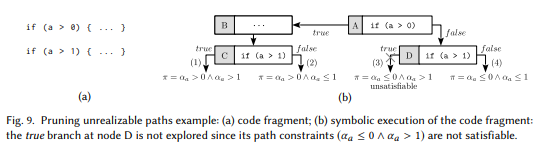  
>> Example. Consider the following code fragment [22]:  
int x = sym_input (); // 例：ファイルから読み取る  
while ( x > 0) x = sym_input ();  
ここで，sym_input()は，環境と対話する(例えば，ネットワークから入力データを読み込む)外部のルーチンであり，新しいシンボリック入力を返します．任意の最終状態で設定される経路制約は，次の形式をとります．  
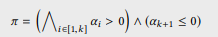  
ここで，kは反復回数であり，α_iはi回目の反復でsym_input()によって生成されたシンボルです．

ループ探索を限られた反復回数に制限するのは簡単なことですが，興味深い経路はこのアプローチでは簡単に見逃す可能性があります．したがって，コード部分の繰り返しの探索を防止する要約戦略，または計算の特性を帰納的に表し，不変量を推論し，または別個のループ反復または関数呼び出し間の類似性を特徴付けることによって，より多くの研究がより進歩した戦略を探究しています．このセクションの残りの部分では，よく状態空間の関連するサブセットのみを探索する目的で，分析の過少近似の計算に基づく，様々な顕著な技術を提示します．

### 5.1 実現不可能な経路の切り捨て
経路空間を縮小する最初の自然な戦略は，各分岐で制約ソルバーを呼び出し，実現不可能な分岐を切り捨てることです．分岐の経路制約によって与えられる論理式が充足できないことをソルバーが証明できる場合，プログラムの入力値割り当てを行って，その経路に向かって実際の実行を動かすことはしないことで，確実性に影響を与えることなくシンボリックエンジンによって安全に切り捨てることができます．この戦略の例を図9に示します．このアプローチは，制約が各分岐で熱心に検査され，通常はほとんどのシンボリックエンジンではデフォルトであるため，経路制約の熱心な評価と呼ばれます．制約ソルバの負担を軽減する目的で，遅延評価と呼ばれる反対の戦略については，第6章を参照してください．  
検査する経路の数を減らすのに役立つ直交アプローチは[90]に示されています．SMTソルバーは，一度に1つの経路で大きな検索空間を探索することができますが，多くの経路で共有される制御フローに対して推論が終了することがよくあります．この作業では，満たされていないことが判明している各経路から最小限の充足不可能コアを抽出し，充足不可能な状態を維持しながらできるだけ多くの文を削除することで，この観察を活用しています．したがって，エンジンは，充足不可能コアを使用して，同じ(充足不可能な)文を共有する経路を切り捨てることができます．

### 5.2 関数とループの要約
コード・フラグメント(関数またはループ本体)が複数回横断されると，シンボリック・エグゼキュータはその後の再利用のためにその実行の要約を作成できます．

関数要約．関数fは，同じ呼び出しコンテキストでも，異なる呼び出しコンテキストでも，実行中に複数回呼び出すことができます．実行者が以前に発見された分析結果を効率的に再利用できるように，fを呼び出すたびにシンボリックに実行するプレーン・エグゼキュータとは異なり，コンクリック・エグゼキュータの[50]で提案された構成アプローチは動的に関数要約を生成します．この手法では，経路wの探索中に観測された関数入力に対する制約を結合し，コンクリート実行の等価クラスを記述し，出力上で観察される制約を伴う式Φ_wの関数呼び出しの影響を捕捉します．入力および出力は，アクセスされたメモリ位置の観点から定義されます．関数要約は，異なるクラスからのΦ_w式の論理和として定義される命題論理式であり，実行可能な手順間経路は，手順内のシンボリック実行を構成することによってモデル化されます．[4]は，解釈されない関数を持つ一次論理式として要約を生成することにより，構成的なシンボリック実行を拡張し，より多くの文がカバーされるように手順間解析中に必要に応じて拡張できる不完全要約(すなわち，関数内の経路のサブセットのみを取得する)を作成できるようにします．

[14]は，以下の直感に基づいて異なる要約を探究します．2つの状態が後で読み込まれないプログラム値のみ異なる場合，2つの状態によって生成された実行は同じ副作用を生成します．したがって，コードフラグメントの副作用はキャッシュされ，おそらく後で再利用される可能性があります．  
ループ要約．関数呼び出しと同様に，[54]で説明されているように，ループの部分集計を取得できます．ループ要約は，ループ条件とシンボリック変数の間の依存関係を推論することによって，シンボリック実行中に動的に計算される事前条件と事後条件を使用します．キャッシング・ループ要約は，シンボリック・エンジンが同じプログラム状態で同じループの冗長な実行を避けるだけでなく，異なる条件で同じループの異なる実行をカバーするように要約を一般化することも可能にします．

初期の研究では，固定量を追加することで反復全体のシンボリック変数を更新するループ要約のみを生成することができます．また，ネストされたループまたは複数経路ループ，すなわち，それらの中に分岐を有するループを処理することはできない．Proteus [113]は，複数経路ループを要約するために提案された一般的なフレームワークです．経路条件(帰納変数が更新されるかどうか)およびループ内の経路のインターリービング(すなわち，規則性があるかどうか)の値の変化のパターンに従ってループを分類します．この分類は，制御フローグラフの拡張形式を利用し，次にこれを使用してインタリーブをモデル化するオートマトンを構築する．深さ優先方式でトラバースされたオートマトンとその中のすべての実現可能なトレースに対して論理和要約が構築されます．ここで，トレースはループ内の実行を表します．この分類では，ループを正確にまたはほぼ取り込むことができるかどうか(実際には関連している可能性がある)，またはそうでないかどうかが決まります．不規則なパターンまたは非帰納的な更新を伴う複数経路ループの正確な要約，さらに重要なことにネストループの要約は，未だに研究上の問題が残っています．  
異なる流れの中で，[96]で導入されたコンパクション手法は，制御フローグラフの循環経路の解析によって，コンパクトなシンボリック実行ツリーとしてコードの一部によって生成されたプログラム状態を宣言的に記述するテンプレートが生成されます．テンプレートを利用することで，シンボリック実行エンジンはプログラム状態の数を大幅に減らすことができます．このアプローチの欠点は，テンプレートが経路制約に数量を導入することです．これは，制約ソルバーの負担を大幅に増加させる可能性があります．

### 5.3 経路包摂と等価
大きなシンボリック状態空間は，新しい発見に導くことができないの経路を破棄する，または有益なときに抽象的に離れた差異を抽出など，経路の類似性を探索する技法の範囲を提供します．このセクションでは，これらに沿ったいくつかの作業について説明します．

補間．現代のSATソルバーは，検索と推論の相互補完的な組み合わせに頼っており，後者を使用して，前者を衝突から遠ざけブロックします．同様の方法で，シンボリック実行は，望んだ特性を示さないプログラム経路から特性を導出する補間技術から利益を得て，それを充足しない類似の経路の探索を防止します．  
Craig interpolants [34]は，数式に関するどの情報がプロパティに関連するかを決定することを可能にする．P → IとI → Qが有効であり，Iのすべての非論理記号がPとQの両方で発生するような補間Iを構築することができます．補間は一般にプログラムで使用されます．充足不可能な公式P ∧ Qについての反証が与えられた場合，P → Iが有効であり，I ∧ Qが満たされないような逆補間Iを構築することができます．  
補間は，モデル検査，述語抽象化，述語洗練，定理証明，および他の分野で主に用いられてきました．例えば，補間法は，遷移関係が所定の境界まで展開されているプログラムの安全特性を改ざんすることを目的とする有界モデル検査を拡張するための方法論を提供します．特に，有界プルーフは無限プルーフの成分を含むことが多いため，補間は，有界ケースに対する反証からすべての到達可能な最終状態の過大近似を構築し，違反がないことを証明するのに十分な過大近似を得るのに役立ちます．

補間による包摂．明示的なエラー位置でマークされた(例えば，アサーションを使用して)プログラムを記号的に検証するときに，補間法を使用して経路爆発の問題に取り組むことができる．探索が進むにつれて，エンジンは各プログラム位置に，エラー位置に到達することができなかった以前の経路を要約する条件で注釈を付けます．分岐が発生するたびに，エグゼキューターは，経路条件が以前の探索によって包摂されているかどうかを検査します．最良の場合のシナリオでは，このアプローチは訪れた経路を指数関数的に減らすことができます．  
[75]は，分岐と文の注釈アルゴリズムを提案しています．つまり，ラベルが現在の状態によって暗示されていれば，エラー位置につなげることはできません．補間は，包含を効率的に計算するための弱いラベルを構成するために使用されます．プログラム位置に事後条件，すなわち前回の探索からの経路接尾辞を要約する最も弱い事前条件が付加された，事後条件付きシンボリック実行と呼ばれる同様の冗長除去方法が提案されています[117]．ここでの直観は，補間が弱ければ経路包摂ができる可能性が高いということです．事後条件は，完全に探索された経路から段階的に構築され，後方に伝搬されます．分岐に遭遇すると，対応する事後条件は否定されて経路制約に追加され，経路が以前の探索によって包摂されていれば充足されません．  
経路包摂の確実性は，ある場所に対して計算された補間が，それを通過する経路の全体を捕捉するという事実に依存します．このように，経路選択戦略は補間構造を実現する上で重要な役割を果たします．たとえば，DFSは経路をすばやく探索できるため，補間を構築して最終的に後方に伝播できるので非常に便利です．同様の経路がまだ完全には探究されていないため，分岐の冗長性を検査するときに補間が利用できない可能性があるため，BFSは代わりに包摂を妨げます．[59]は，DFS以外のヒューリスティクスを使用するときに経路包摂の恩恵を受けることを可能にし，補間の形成から経路選択問題を切り離すような，貪欲確認と呼ばれる新規戦略を提案しています．貪欲確認は，経路のツリーが完全にまたは部分的に探索されたノード間を区別します．後者の場合，補間の形成を可能にするために追加経路の制限されたトラバーサルを実行します．  
補間は，与えられた時間内で複雑なプログラムのより大きな部分の探索を可能にすることが有用であることが証明されています．[117]は，経路の冗長性が現実のアプリケーションでは豊富で広範囲に及んでいると主張しています．通常，補間のオーバーヘッドは，SMTソルバ内または専用エンジン内で実行することができるため，初期段階での探査が遅くなりますが，初めのころとは打って変わって劇的に利益が上がり，より速い探査が可能になります[59]．

無限ループ．コード内に無限ループが存在すると，非常に多数の経路がそれらを通過できるため，プログラム内のプログラムの場所で確実な包摂を実行するのが難しくなります．[75]は固定の深さまでループを展開し，ループ不変である補間を計算しようとする反復深化戦略を考案し，無限大のエラーノードの到達不可能性を証明するために使用できるようにします．ただし，この方法は，論理和ループ不変量を必要とするプログラムでは終了しないことがあります．したがって，[61]はループのシンボリック実行を迅速に収束させるのに十分強い不変量を推測し計算する戦略を提案するが，可能な限り経路を包摂するくらい十分に緩いです．フォローアップ作業[60]では，ループ不変量は拡張演算子を使ってシンボリック実行中に別々に発見され，経路包摂の最弱事前条件は不変量に伴うように構築されます．我々は，他のプログラム検証技術における多くのアプリケーションの恩恵を受けることができ，また，構築された不変量がエラーノードの到達可(不可)能性を捕捉するのに十分正確であるならば，主流のシンボリックエグゼキュータの効率的な実施に従うことができるので，この設定で抽象的な解釈を使用する考え方(最初に[62]で示唆された)を信じてきました．

抽象化の包摂．補間に基づかないアプローチは[6]で取り上げられます．これは，シンボリック状態の2倍の包摂検査手法を記述しています．シンボリック状態は，シンボリック・ヒープと一連の制約を超えたスカラー変数に対する観点から定義されます．したがって，この技術は，スカラー型だけでなく，初期化されていない，または部分的に初期化されたデータ構造も操作するプログラムを対象としています．グラフトラバーサルによるヒープ構成のマッチングのアルゴリズムが提示されていますが，既成のソルバーを使用してスカラーデータの包摂について推論します．  
無限の数の状態に対処するために，シンボリック状態空間を有限にして包摂を有効にする抽象化を提案します．抽象化は，ヒープの形状とスカラーデータの制約の両方を要約することができます．リンクリストと配列の例が示されています．潜在的な振る舞いが見逃される可能性があることを意味する，過少近似状態での包摂検査が行われます．著者はモデルチェッキングと組み合わせた改ざんシナリオでこの手法を採用しており，将来の研究として，シンボリック実行のみに基づく検証への応用を示しています．

経路分割．コントロールとデータフローの依存分析では，探索中に追加のプログラム動作を明らかにできない経路をフィルタリングするために使用できるカジュアルな関係が公開されます．[74]非干渉ブロックでコンクリック実行のための入力を分割し，各ブロックを記号的に探索し，他のものは具体的な値に固定されたままにします．2つの入力の干渉は，それらが共同して1つの文に影響するか，または制御またはデータ依存によってリンクされた文に発生します．[84]は出力に焦点を当て，プログラム出力に関して同じスライスを持つ場合，2つの経路を同じパーティションに配置します．関連するスライスとは，動的データおよび制御依存関係の推移閉包であり，実行されないことによって出力に影響を及ぼす文を含む可能性のある依存関係も含みます．[109]は，個々の文の関連スライスを構築し，それらがシンボリック入力からどのように計算されるかを補足することによって，出力に関係のないフォールトも探索します．依存関係分析は，すべての文インスタンスのスライスが以前の経路によって集合的にカバーされている場合，経路が冗長であるとみなし，スライスの等価性を効率的に検査します．

### 5.4 過少制約シンボリック実行
経路爆発を避けるためのアプローチは，解析対象のコード(関数など)をその囲むシステムから切り離し，それを孤立させて検査することです．複雑なデータ構造を自動的に再構築するために，ユーザー指定の事前条件(3.4節)を使用した遅延初期化がこの原則に従います．しかし，アプリケーションからコード領域を取り出すことは，周囲の環境との絡み合いのために非常に困難になる可能性があります[45]．孤立して解析された関数で検出されたエラーは，偽陽性である可能性があり，関数が完全なプログラムのコンテキストで実行されるとき，入力が決して特定の値をとることはありません．いくつかの先行研究(例えば，[35])は，まずコードを孤立して解析し，コンクリート実行を使用して生成された衝突入力をテストして偽陽性を除外します．

過少制約シンボリック実行[45]は，シンボリック入力のマーキングとその実行に影響する可能性のあるグローバルデータを過少制約としてマークすることによって，孤立した関数の解析を可能にするシンボリック実行のひねりです．直観的には，シンボリック変数は，解析の際に，プログラムのエントリポイントから関数への経路接頭辞に沿って収集されるべき値の制約を考慮していない場合，制約が不十分です．実際には，シンボリックエンジンは，手動介入なしでメモリアクセスをトレースとそれらの位置を特定することによって，自動的にデータを過少制約されたものとしてマークすることができます．例えば，スタック上にある初期化されていないデータに対してメモリリードが実行されます．過少制約変数は，エラーを発生させる可能性のある式で使用される場合を除いて，古典的な完全制約記号変数と同じ意味を持ちます．特に，変数は，現在知られている変数上の制約のすべての解がそれを引き起こす場合にのみ，エラーが報告されます．すなわち，エラーは文脈依存であり，したがって真の肯定です．それ以外の場合は，その否定が経路制約に追加され，通常どおり実行が再開されます．このアプローチは，コードに挿入された検査から事前条件を再構築する試みと見なすことができます．追加された否定された制約に違反する後続のアクションはエラーとして報告されます．この解析を正しく行うためには，式が過少制約された値と完全に制約された値の両方を含む場合はいつでも，マークを変数間に伝播する必要があります．たとえば，a > bの形式を比較するとき，aが過少制約で，bがそうでない場合，汚れた値を扱うときのテイント分析の場合と同様に，エンジンはaからbにマークを伝播します．マークは，通常，シャドーメモリを使用してシンボリックエンジンによって追跡されます．  

この手法は確実ではなく，エラーを見逃してしまう可能性がありますが，大規模なプログラムでは面白いバグを発見するためには拡張できます．また，過少制約シンボリック実行のアプリケーションは，関数のみに限定されません．例えば，コード領域(例えば，ループ)がシンボリックエグゼキュータにとって厄介な場合，その影響を受ける場所を過少制約のようにマーキングすることによってスキップすることができます．一般に，スキップされたコードの実行によってどのデータが影響を受けるかを理解することは容易ではないので，分析を正しく維持するためには手動による注釈が必要な場合があります．

### 5.5 事前条件と入力機能の利用
経路爆発を減らす別の方法は，いくつかの入力プロパティの知識を活用することです．AEG [8]は，事前条件述語を満たす入力空間の部分集合に探索を向けることによって，探索状態の数を減らすために事前条件付きシンボリック実行を提案しています．その根拠は，プログラムの特定の振る舞いにつながる可能性のある入力に焦点を絞ることです(例えば，潜在的なバッファオーバーフローを明らかにするために，探索を最大サイズの入力に絞り込む)．事前条件シンボリック実行は，パフォーマンスのため確実性を犠牲にしています．明確に設計された事前条件は，あまりにも具体的でなく(おもしろい経路を見逃すかもしれません)あまりにも一般的ではありません(状態空間の減少によるスピードアップを損なうでしょう)．空の経路制約セットから始めるのではなく，最初のπに事前条件を追加して，残りの探索がそれらを満たさない分岐をスキップします．初期化時にπに多くの制約を追加すると，各分岐でより多くの検査を実行するために必要なソルバーの負担が増える可能性がありますが，状態空間が小さくなるためパフォーマンスが大幅に向上します．  
既知の長さ(すなわち，バッファのサイズは既知です)，既知の接頭辞(すなわち，バッファは既知の接頭辞があります)，および完全に既知である(すなわち，バッファの内容は完全に具体的です)．これらの事前条件は，よく知られている文字列の構文解析ツールやパケット処理ツールなど，あらかじめ定義された構造を持つ入力を操作するコードを処理する場合には当然です．

>> 例．次の単純化されたパケットヘッダ処理コードを考えてみましょう.pktは入力バッファを指し，ヘッダは固定された予想されるコンテンツを指します．事前条件が考慮されていない場合，このコードは指数関数的な数の経路を生成できます．不一致があると，get_inputへの新しい呼び出しが強制されます．一方，既知の接頭辞の事前条件が入力に設定されている場合は，ループを探索するときに単一の経路のみが生成されます．したがって，エンジンはparse_payload()にその探索を集中させることができます．  
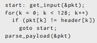

言い換えれば，ループ拡張シンボリック実行と呼ばれる，入力プログラムを記述する文法が有効なときにループを効果的に探索できる手法[88]です．反復回数をプログラム入力の特徴と関連付けることは，ループによって生成されたプログラム状態の探索を有益に導き，経路爆発問題を軽減することができます．

### 5.6 状態のマージ
状態のマージは，異なる経路を単一の状態に融合する強力な手法です．マージされた状態は，個々の状態が分離されている場合に記述された式の論理和を表す式によって記述されます．抽象解釈などの他の静的プログラム解析手法とは異なり，シンボリック実行でのマージは過大近似にはなりません．

>> 例．以下に示す関数fooと，図10aに示すシンボル実行ツリーを考えてみましょう．最初(実行状態A)，経路制約は真であり，入力引数xおよびyは記号値α_xおよびα_yにそれぞれ関連付けられます．  
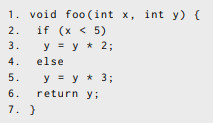  
2行目の条件分岐によって分岐後，異なる文が評価され，シンボルα_x(それぞれステートBおよびC)で異なる前提が作成されます．最終的にすべての分岐で6行目のリターンに達すると，シンボリック実行ツリーには2つの追加の状態DとEが設定されます．アクティブ状態の数を減らすために，シンボリックエンジンは状態マージを実行できます．例えば，図10bは，6行目でのリターンを評価する前に状態マージ操作が実行されたときの同じコード片のシンボリック実行DAGを示めしています．D'は，前の実行状態DおよびEをiteを用いて完全に捕捉するマージされた状態です．式ite(α_x< 5，2 * α_y，3 * α_y)(3.1節)．実行状態DとEの経路制約は，論理和式α_x < 5 ∨ α_x ≥ 5にマージされ，D'で真に単純化されることに注意してください．  
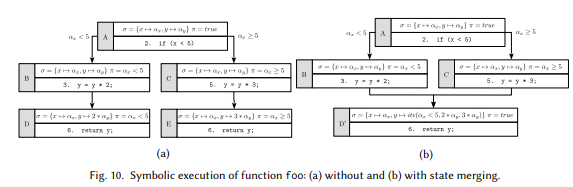  
トレードオフ：マージするかマージしないか．原理的には，同じ文を評価しようとしている2つのシンボリック状態がシンボリックストア内で非常に似ている(すなわち，少数の要素のみが異なる)場合に状態マージを適用することは有益であるかもしれません．(stmt，σ_1，π_1)と(stmt，σ_2，π_2)の2つの状態が与えられたとき，マージされた状態は(stmt，σ'，π_1 ∨ π_2)として構築することができます．ここでσ'はσ_1とσ_2間のマージされたシンボリックストアで，違うストレージに記録し，格納することを考慮したite表現で構築され，π_1 ∨ π_2は2つのマージ状態からの経路制約の和集合です．if-else文(前の例のような)や単純なループのような制御フロー構造は，よく状態マージの非常に良い候補を表すかなり類似した後続の状態を生成します．

初期の研究[50,57]は，マージ技法が探索する経路の数を効果的に減らすだけでなく，制約ソルバに負担をかけることを示しており，これは論理和によって妨げられる可能性があります．マージは，例えば条件付き代入からの異なる具体的な値を条件上のシンボリック式にマージするときなど，新しいシンボリック式をコードに導入することもできます．[70]は，状態マージ技術の設計空間に関する優れた議論を提供しています．スペクトルの一方の端では，検索ベースのシンボリック実行(セクション2.2)で使用される経路の完全な分離はマージを行いません．もう一方の端では，静的状態のマージは，制御フローの結合点で状態を結合します．基本的にプログラム全体を単一の式で表現します．静的状態マージは，通常，ループを1回だけ展開することによってスケーラビリティのために精度を犠牲にします．これは全プログラム検証条件生成器[10,114]で使用されています．

ヒューリスティックにマージする．中間のマージソリューションはヒューリスティックを採用して，探索プロセスを高速化できる状態マージを特定します．実際には，より大きなシンボリック表現を生成し，場合によっては余分なソルバの呼び出しを生成することは，より少ない状態を有する利点よりも重要であり，全体的な性能がより悪くなる可能性があります[57,70]．問い合わせ数の推定[70]は，単純な静的分析を使用して，どのくらいの頻度で分岐条件で各変数がよく使用されるかをControl Flow Graph(CFG)の任意の与えられたポイントを越えたかで識別します．この見積もりは，特定の変数が含まれる可能性が高いソルバ問合せの数のプロキシとして使用されます．2つの状態は，異なる変数が後の問い合わせで頻繁に表示されないと予想される場合に，マージの候補になります．Veritesting [9]は，簡単な文と困難な文の区別に基づいてヒューリスティックをマージする形式を実装しています．文は，間接的なジャンプ，システムコール，および精密な静的解析が困難なその他の操作を含みます．静的マージは，簡単な文の順序に対して実行され，その効果はite式を使用して補足され，経路ごとのシンボリック・エクスプローラは，分析が困難な文に遭遇するたびに実行されます．

動的状態マージ．マージの機会を最大限にするために，シンボリックエンジンはCFGをトラバースして，プログラムポイントの結合された状態を，例えば，グラフが非周期的である場合，トポロジカルな順序付けに従って，前のものから計算することができます．しかし，これは「興味深い」状態を優先させる探索戦略を妨げるでしょう．[70]は，探索戦略によって課せられた探索順序に関係なく機能する動的状態マージを導入します．シンボリック・エンジンが状態のワークリストと前任者の有界な履歴を保持しているとします．探索のために次の状態を選択する必要があるとき，エンジンはまず，作業リストからs_1とs_2の2つの状態がマージには一致しないが，s_1とs_2の前のものが存在するかどうかを検査します．s_2とs_1の後継者の間の予想される類似性も高い場合，アルゴリズムはs_1の実行を固定数のステップで進めることによってマージを試みます．これは，2つの状態が似ている場合，それぞれの後継者もいくつかの段階で類似する可能性が高いという考えを捉えています．マージが失敗した場合，アルゴリズムは探索ヒューリスティックが探索すべき次の状態を選択することを可能にします．

### 5.7 プログラム分析と最適化手法の活用
プログラムの振る舞いをより深く理解することは、シンボリック・エンジンがその分析を最適化するのに役立ち、有望な状態に集中することができる（例えば、計算ツリーの無益な部分を切り取ることによって）。シンボリック実行実行の文献でいくつかの古典的なプログラム分析技術が探求されてきました。ここでは、いくつかの顕著な例について簡単に説明します。

プログラムスライシング。この分析は、プログラムの振る舞いのサブセットから始まり、プログラムからその行動を忠実に表す命令の最小連続を抽出します[110]。この情報は、シンボリックエンジンをいくつかの方法で助けることができます。たとえば、[94]は後方プログラムスライシングを利用してシンボリック探索を特定のターゲットプログラムポイントに対して制限をします。

テイント解析。この技法[89]は、プログラムのどの変数が、ユーザ入力などの潜在的に危険な外部ソースから導出された値を保持しているかを検査しようと試みます。解析は、静的および動的の両方で行うことができ、後者はより正確な結果をもたらします。シンボリック実行のコンテキストでは、テイント解析は、エンジンが汚染された値に依存する経路を検出するのに役立ちます。たとえば[25]は、ジャンプ命令が汚染されている経路上の解析に焦点を当て、シンボリック実行を使用して攻撃を生成します。

ファジング。このソフトウェアテスト手法では、クラッシュまたはアサーションの失敗を引き起こす可能性のあるユーザ入力のテスト入力をランダムに変更し、潜在的なメモリリークを検出します。ファジングは、シンボリック実行で補完して入力の制約を収集し、それらを否定することで新しい入力を生成することができます。一方、シンボリック・エグゼキュータは、探査のより深い状態により迅速かつ効率的に到達するために、ファジングで拡張することができます。この考え方の2つの顕著な実施形態は、ハイブリッドコンクリックテスト[73]およびDriller[101]によって示されています。

分岐予測。これは、コードの非常に小さな部分のジャンプを避けることによって、パイプライン実行での誤予測のペナルティを軽減するための戦略です。たとえば、C言語の三項演算子などの制御フロー分岐構文を、予測付き選択命令に置き換えることができます。[30]は、シンボリック実行を使用してプログラムの2つの実装をクロスチェックするときに、この戦略の採用から探索する経路の数が指数関数的に減少することを報告しています。

型検査。シンボリック解析は、型付き検査と効果的に混在することができます[65]。たとえば、型検査では、シンボリックに解析するのが難しい関数の戻り値の型を判断できます。この情報は、エグゼキュータが特定の経路を切り捨てるために使用されます。（たとえば、型チェッカーの精度を向上させるために、特定の型エラーを排除する変数に文脈依存のプロパティーを提供するなど、シンボリック解析が型検査にどのように役立つかについても取り上げています。）

プログラム差分。依存分析では、コード編集の影響を受ける分岐およびデータフローを識別できます。直接的インクリメンタルシンボリック実行[116]は、変更の影響を受けるCFGノードを静的に識別し、そのような情報を使用して、影響を受けたノードのカバーされていない順序を実行する経路のみに探索を進める。

コンパイラの最適化。[19]は、プログラムの最適化手法は、検索ヒューリスティック、状態マージ、制約解決の最適化など、広く受け入れられているソリューションと並んで、シンボリック実行の実用的な実装の第一級の要素でなければならないと主張しています。実際、プログラムの変換は、経路探索中に生成された制約の複雑さと探索自体に影響を与える可能性があります。例えば、ルックアップテーブルを使用して関数の結果を事前に計算すると、メモリアクセスによる経路条件の制約の数が増加し、乗算の強度低下を適用すると、制約ソルバーに対してより高価な加算演算の連鎖が生じる可能性があります。また、高レベルのswitch文をコンパイルする方法は、経路探索のパフォーマンスに大きく影響する可能性がありますが、LLVMやsetcc、cmovでの選択などの条件付きの命令を使用すると、シンプルなite式を生成して高価な状態フォークを回避できます。  
実行時に実行される命令の数やサイズでコンパイラ最適化の効果は通常予測できますが、シンボリック実行[41]では同様の減少は明白ではありません。これは主に、制約ソルバーが通常ブラックボックスだからです。私たちが知る限りでは、コンパイラ最適化が制約生成と経路探索に及ぼす影響を分析しようとした研究はほんのわずかであり[41、108]、興味深い未解決の問題が残されています。異なる観点として[80]に示されている作業は、配列の理論（3.1節）に基づいてシンボリックエグゼキュータのメモリ操作を高速化するための動的定数畳み込みや最適化された制約のエンコーディングなどの変換を調べています。

## 6 制約解決
ソフトウェアプログラムの分析、テスト、検証など、多くの分野で制約充足問題が発生します。制約ソルバーは、論理式で表現された問題の決定手順です。たとえば、論理的充足可能性問題（SATとも呼ばれます）は、論理式の記号の解釈が存在するかどうかを判断することを目的としています。SATはよく知られているNP完全問題ですが、最近の進歩は実際のアプリケーション[37]では難しいものの境界を移しています。  
いくつかの問題は、論理的結合を持つ論理式の表現よりも表現力豊かな言語でより自然に記述されることに注意してください。この理由のために、充足可能性剰余理論（SMT）は、例えば配列に対する線形算術および演算を含む理論をサポートするSAT問題があります。SMTソルバは、SMT式の原子を新しい論理変数にマッピングします。SAT決定手順は、書き換えられた式を満たすかどうかを検査し、SAT手順によって生成されたモデルを理論ソルバが検査します。

SMTソルバーはいくつかの特有の強みを示しています。それらのコアアルゴリズムは汎用的であり、多数の個々の制約の複雑な組み合わせを扱うことができます。それらは漸進的に働き、制約が追加または削除されるとバックトラックすることができ、矛盾の説明を提供することができます。理論は、例えば文字列の配列についての理由など、任意の方法で追加および結合することができます。決定手順は単独で実行する必要はありません。多くの場合、非線形算術式の中にある線形部分を最初に解決するなど、より重い手順で費やされる時間を短縮するために有益に組み合わせられます。不完全な手順も貴重です。決定的な回答が得られない場合にのみ、完全に高価な手順が呼び出されます。これらの要因はすべて、SMTソルバーが単一の手順で孤立して解決できない大きな問題に取り組むことを可能にします（興味深い読者にはSMT解析の包括的な導入[13]について、[2]には特有の強みについての議論があります）

シンボリックエグゼキュータでは、制約の解決は経路の実現可能性の検査、シンボリック変数への代入の生成、およびアサーションの検証において重要な役割を果たします。サポートされている理論と当時の相対的なパフォーマンスに応じて、長年にわたり、シンボリックエグゼキュータによって異なるソルバーが採用されてきました。例えば、STP [49]ソルバーは、EXE [21]、KLEE [20]、AEG [8]などに採用されており、ビット・ベクトル理論と配列理論のサポートを活用しています。Java PathFinder [77]のような他のエグゼキュータは、複雑な非線形数学的制約[100]を扱うヒューリスティックと追加の決定手順（例えば、制約プログラミングのライブラリ[83]）でSMT解を補完しています。

近年、Z3 [36]がSMT解決のための主要な解決策として浮上している。Microsoft Researchで開発されたZ3は、最先端のパフォーマンスを提供し、ビットベクトル、配列、量指定子、未解釈関数、線形整数と実数演算、非線形演算など、多数の理論をサポートしています。そのZ3-str [119]拡張は、文字列をプリミティブ型として扱うことを可能にし、ソルバーが連結、部分文字列、および置換などの一般的な文字列演算を扱うことができるようになっています。Z3は、Mayhem [25]、SAGE [53]、Angr [95]のような、最近登場したシンボリックエグゼキュータで採用されています。Z3の多数のサポートされている理論のために、そのようなエグゼクティブは通常、追加の決定手順を採用しません。

しかし、過去数年間に顕著な進歩が見られたにもかかわらず、シンボリック実行を最初に実用化した[22]の制約解決は、シンボリック実行エンジンのスケーラビリティに対する主な障害の1つであり、また、高価な理論（例えば、非線形算術）や不透明なライブラリ呼び出しを伴う制約に直面して実現可能性を妨げています。このセクションの残りの部分では、シンボリック実行に適したプログラムの範囲を広げ、制約解決のパフォーマンスを最適化するためのさまざまなテクニックについて説明します。顕著なアプローチは、（i）検査する制約のサイズと複雑さを減らすこと（ii）制約解法のキャッシング、ソルバ問合せの延期、または具象化によってソルバの負担を軽減する（iii）決定手順に問題のある制約を処理するためのシンボリック実行の強化です。

制約削減。ソルバーとシンボリック・エグゼキュータの両方に共通の最適化アプローチの後には、制約をより簡単な形に減らすことができます。例えば、式の書き換えの最適化は、定数畳み込み、強度低下、線形式の単純化などのコンパイラの最適化からの古典的な手法を適用することができます（例えば、KLEE [20]を参照）。  
EXE [21]は、制約のセットが頻繁に複数の独立した制約のサブセットに分割されるという事実を利用する制約独立性の最適化を導入しています。この最適化は問い合わせ結果のキャッシング戦略とうまくやり取りし、問い合わせから無関係な制約を削除するため、エンジンが特定の制約の充足可能性をソルバに尋ねるときに追加の利点を提供します。事実、実際のプログラムで頻繁に使用される傾向のある独立した分岐は、迅速に蓄積される不要な制約につながる可能性があります。  
削減技術によって利用できるもう1つの事実は、プログラムの自然な構造が、実行が進むにつれて、いくつかの変数に対してより具体的な制約を導入することができるということです。新しい条件を既存の順序に結合することによって経路条件が生成されるので、既存の制約を書き換えて最適化することが可能になる可能性があります。例えば、x ：= 5という形式の等価制約を追加すると、変数の値（x > 0など）に対して他の制約の真偽を単純化するだけでなく、それを含む他の後続の制約のシンボルxに関連する具体値に置換することができます。後者の最適化は、暗示的値の具体化としても知られており、例えばKLEE [20]によって採用されています。  
同様の趣旨で、S2E [29]はビット操作理論を簡略化して、ビット操作がマスクするシンボリック変数を具体的な値の部分に置き換えます。例えば、任意の8ビット記号値vについて、式v | 100000002の値の最上位ビットは常に1です。簡略化は式のツリー表現を介して情報を伝播でき、その値の各ビットを判別できる場合、式は対応する定数で置き換えられます。

制約ソリューションの再利用。制約解決を高速化するために以前に計算された結果を再利用するという考え方は、特に制約独立性最適化のような他の技法と組み合わされたときに、シンボリックエグゼキュータの設定において特に効果的です。制約解決のためのほとんどの再利用アプローチは、現在、制約の意味論的または構文的等価性に基づいていています。  
EXE [21]は、ソルバーを呼び出す必要性をできるだけ減らすために、制約解と充足可能性問い合わせの結果をキャッシュします。キャッシュは、実行エンジンの複数の並列インスタンスからそれぞれ異なるプログラム状態を探索する問い合わせを受信できるサーバープロセスによって処理されます。  
KLEE [20]は、反例的キャッシングと呼ばれる追加最適化戦略を実装しています。制約セットがキャッシュを使用して具体的な変数割り当てにマッピングされるか、制約セットが満たされない場合に特別なNULL値にマッピングされます。キャッシュ内の満たされていないセットが、与えられた制約セットSのサブセットである場合、Sも同様に満たされないとみなされます。逆に、キャッシュにSのスーパーセットの解が含まれている場合、その解もSを自明に満たします。最後に、キャッシュがSの1つまたは複数のサブセットの解を含む場合、アルゴリズムは、すべての解をSに満足する解が見つかるかどうかを検査することを試みます。  
Memoized symbolic execution [115]は、シンボリック実行によって、バグを見つけて修正し、修正プログラムが有効であるかどうかを再度テストするなど、ほとんど同じような部分問題を再実行することが多いという観察によって動機付けられます。経路探索中に取られた選択肢は接頭辞ツリーにコンパクトにエンコードされ、連続して実行されたときに以前に計算された結果を再利用する可能性が開かれます。  
グリーン・フレームワーク[106]は、同じプログラムだけでなく、類似のプログラム、異なるプログラム、および異なる分析の実行にわたって制約解決の再利用を探求しています。制約はスライシング変換を通じて重要な部分が抽出され、1回の解析実行でも良好な再利用を実現するために標準形式で表現されます。[64]は、制約の再利用とより速い実行時間をサポートするための制約間の論理的な関係を利用するフレームワークの拡張を示しています。

遅延制約。[85]は、制約ソルバー問い合わせのタイムアウトアプローチを採用しています。最初の実験では、ほとんどのタイムアウトをシンボリック除算と残りの演算に追跡しました。最悪の場合は、符号なしの剰余演算が分母にシンボリック値を持つときに発生します。彼らは以下のように動作するソリューションを実装しました。エグゼキュータが高価なシンボリック操作を含む分岐文に出会うと、真の分岐と偽の分岐の両方をとり、高価な操作の結果に経路条件に遅延制約を追加します。探索が何らかの目標を満足する状態（例えば、エラーが見つかる）に達すると、アルゴリズムは経路の実現可能性を検査し、実際の実行において到達不能であると判断した場合にはそれを抑制します。  
遭遇した分岐の実現可能性を検査する熱心なアプローチ（第5.1節）と比較して、遅延戦略は、より多くのアクティブ状態につながり、より多くのソルバー問い合わせにつながる可能性があります。しかし、著者らは遅延問い合わせの多くの場合、彼らの熱心なアプローチよりも効率的であると報告しています。遅延制約後に追加された経路制約は実際にソルバの解空間を狭めることができます。

具体化。 [22]は、制約ソルバーが解くことができない式の存在下で、古典的なシンボリック実行の限界を論じています。コンクリックエグゼキュータは、プログラムのランダムな入力を生成し、具体的にも記号的にも実行します。具体的な実行の可能な値は、ソルバーにとって本質的に困難な式に関係するシンボリック被演算子を使用できますが、探索の確実性を犠牲にします。  
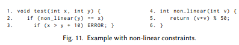  

>> 例。図11のコード断片では、エンジンは、2行目の真の分岐に対してα_x = （α_y * α_y） % 50という形式の非線形制約を格納します。非線形演算をサポートしないソルバは、どんなプログラムの入力も生成に失敗します。しかし、コンクリックエンジンは、具体的な値を利用してソルバーを助けることができます。例えば、x = 3およびy = 5が初期入力パラメータとしてランダムに選択された場合、具体的な実行は2つの分岐をいずれも通りません。それにもかかわらず、エンジンはyの具体的な値を再利用することができるため、α_y = 5のためα_x = 25として以前の問い合わせを単純化します。この問い合わせに対する簡単な解法はエンジンで両方の分岐を探索できるようになることです。yの値が5に固定されていれば、第1の分岐、第2の分岐は通らず、偽の条件の否定を引き起こす新しい入力を生成する方法がありません。この場合、自明な解決策は、yの異なる値を選択してプログラムを再実行することです（例えば、y = 2の場合、x = 4、第1の分岐を満たし、第2の分岐は満たしません）。

具体化に起因する不完全性を部分的に克服するために、[78]は、1つ以上の記号を具体的な値に結びつける前に、経路上で収集可能なすべての経路制約を考慮するコンクリートとシンボリックを混合させた解法を示しています。実際に、DART [51]は、ターゲット分岐まで収集された経路制約に基づいて記号を具体化します。このようにして、同じ経路の後続分岐に含まれる制約は考慮されず、既に具体化された記号のために満足できるものではない可能性があります。これが起こると、DARTは次の分岐を満たすことができるように、異なる具体的な値で実行を再開します。[78]で提示されたアプローチは、全経路に沿って解決可能な制約を検出し、可能な限り具体化を遅らせる必要があります。

問題のある制約の処理。強力なSMTソルバを使用すると、エグゼキュータはより多くの経路制約を直接処理できるため、具体化に頼る必要はありません。これはまた、いくつかの変数についての具体的な値のランダムな選択からの経路条件の過小近似が検索空間の任意の制限をもたらすときに起こり、具体的な値に対する不明瞭な約束をもたらす危険性を低下させる結果となります[39]。しかしながら、特定のクラスの制約に対する決定問題は、例えば、非線形整数算術のように、または実世界システムをモデル化するためにしばしば使用される三角関数を用いた実数の理論のように、決めることができないことがよく知られています。

非線形算術演算とライブラリ呼び出しを含む制御フローの依存関係に取り組むことができるコンクリックウォークアルゴリズムを提案しています[39]。このアルゴリズムでは、変数への値の割り当てを評価空間として扱います。線形制約の解はヒューリスティックに歩くことができる超多面体を定義し、残りの制約には、評価点が制約にどれくらい近いかを測定する適合関数が割り当てられます。超多面体上で点が選択され、非線形制約が評価されると、超多面体に対して適応検索が実行されます。コンクリートシンボリック混合解法[78]と比較して、両方の技法は不明瞭な約束を回避しようとしています。しかし、コンクリックウォークは、複雑な制約を評価するために必要なすべての具体的な入力を得るためのソルバに依存せず、超多面体上を歩き有望な領域に導く検索ヒューリスティックを実装しています。

[40]は、シンボリックバックワード実行（SBE）（セクション2）とフォワードシンボリック実行の新しい組み合わせを記述しています。主な考え方は、探査を2つの段階に分けることです。第1段階では、目標点からSBEが実行され、追跡された経路ごとにトレースが収集されます。後退探索中に問題のある制約が満たされた場合、エンジンはトレースに特別なイベントを追加することによってそれらを潜在的に充足可能なものとしてマークし、逆方向の探索を継続します。プログラムのエントリーポイントが追跡された経路のいずれかに沿って到達するたびに、第2フェーズが開始されます。エンジンは、収集されたトレースを具体的に評価し、第1フェーズで問題があるとマークされた制約をすべて満たそうとします。これは、上で説明したコンクリックウォークなどのヒューリスティック検索を使用して行われます。混合の利点は、古典的なコンクリック実行よりも、一部の実行不可能な経路の探索を防ぐことができるということです。例えば、後方フェーズは、文がどのように到達したかにかかわらず、文が充足不可能な分岐に守られていると判断します、従来のコンクリックエグゼキュータは、経路で「深い」文のような不利な文に達したときにのみ、経路単位で不具合を検出します。

## 7 さらなる方向
このセクションでは、関連する研究分野における最近の進歩がどのように適用されるか、またはシンボリック実行技術の最先端技術を強化するための潜在的な方向を提供する方法について検討します。特に、データ構造の分離論理、経路爆発を扱うためのプログラム検証およびプログラム解析領域からの技術、および非線形制約を扱うためのシンボリック計算について議論します。

### 7.1 分離論理
ポインタープログラムのメモリの安全性を確認することは、プログラムの検証において大きな課題です。近年、命令型プログラムにおけるヒープ操作についての理由の1つの主要なアプローチとして分離論理（SL）[86]が浮上しています。SLはHoare論理を拡張して、ポインタデータ構造を操作するプログラムについての推論を容易にし、ヒープ構成の複雑な不変量を簡潔な方法で表現することを可能にします。  
コアでは、分離結合バイナリ演算子*を使用して、その引数が別々に保持されている2つのコンポーネントにヒープを分割できると主張します。たとえば、述語A * x→[n : y]は、nフィールドにyを保持するレコードを指し示す単一のヒープ・セルxがあり、残りのヒープについてはAが保持されることを示します。
プログラム状態はシンボリックヒープとしてモデル化されるΠ | Σ : Πは変数に関連する純粋な述語の有限集合であり、Σはヒープ述語の有限集合である。シンボリックヒープは、抽象意味論を使用してプログラムのコードに従って記号的に実行されるSL式です。SLルールは、典型的には、シンボリックヒープの付随をサポートし、どのヒープ部分が文の影響を受けないかを推測し、抽象化を介してシンボリック実行の終了を確実にするために使用されます（例えば、拡張オペレータを使用する）。  
SLの成功の鍵は、コードによってアクセスされる唯一のメモリについて述べる仕様を可能にするため、その*演算子によって可能にされる局所的な推論形式にある。これは、可変データ構造を記述するための帰納的定義を導出するという目標にも適合します。他の検証手法と比較して、ユーザに対する注釈の負担は、ほとんどない、またはありません。例えば、[23]で提示された形状解析は、二つの仮説形成を使用して、データ構造上の不変量を自動的に発見し、SL内の合成可能な手続き要約を計算します。  
例えば、ユーザおよびシステムコードにおける自動メモリバグ発見、およびメモリ安全性特性または設計パターンに対する注釈付きプログラムの検証のために、SLに基づくいくつかのツールが利用可能です。それらのいくつかはオーダーメイドの決定手続きを実装していますが[15、81]、決定可能なSLフラグメントの証明者はSMTソルバーに統合でき、プログラム検証に関連する他の理論との完全な組み合わせが可能であることを示しています。これは、より広範な設定でSLのアプリケーションへの道を開くことができます。たとえば、シンボリックエグゼキュータは、リストやツリーなどの構造を操作するコードを帰納的に推論するために使用できます。シンボリック実行はSLの中核ですが、私たちが知る限りでは、これまでシンボリックエグゼキュータでSLを使用していませんでした。

### 7.2 不変量
不変量は、完全な機能仕様に対して正しいプログラムを証明できる検証者にとって重要です。不変量は、初期状態およびそれから到達可能な各状態に対して真である述語です。不変量を利用することは、ループの効果とその理由をコンパクトに捕捉するために、シンボリックエグゼキュータにとって有益です。残念ながら、このアプローチを利用しているシンボリックエグゼキュータを知りません。その理由の1つは、その領域の専門家による手動の介入を必要とせずにループ不変量を計算することの難しさにあるかもしれません。事実、検証の実践から得られた教訓は、ループ不変量を提供することは、メソッドの事前/事後条件などの他の仕様要素と比較してはるかに難しいことを示唆しています。  
しかし、近年、多くの研究者が自動的に、または人間の助けを借りずにループ不変量を推論する手法を研究しています[47]。これは、ループの効率的な処理のためにシンボル実行コミュニティにとって興味深いかもしれません。これらのアプローチは、通常、状態遷移関係のもとで閉じられる帰納的述語を目標とします（すなわち、過去の行動を参照しません）。すべての帰納的述語は不変式ですが、その逆は真ではないことに注意してください。  
インダストリアルコードのプログラム終了を検証するために、ターミネーション解析が適用されています。正式な議論は、通常、すべての状態遷移に対して、少なくとも1つの関数が減少するように、プログラム内の可能な状態すべてにわたって1つ以上のランク付け関数を使用することによって構築されます[31]。ランク付け関数は、例えば、横断されたループ経路からの反例を用いて不変量を遅延的に構築することによって、多くの方法で構築することができます[55]。終了引数は、ループが遷移不変量[104]に基づいた要約に置き換えられた、変換されたプログラムの推論によって構築することもできます。実際のほとんどのループは比較的単純な終了引数を持つことが観測されています[104]。発見された不変量は検証設定のために十分に豊富ではない可能性があります[48]。しかし、反復回数に対する定数またはパラメトリック境界は、ランク付け関数および不変量から計算することができます[55]。  
述語抽象化は、与えられた述語セットを使用して構築されたドメイン上の抽象解釈の一形態であり、配列を操作するときに有用な普遍的な定量化されたループ不変量[46]を推論するために使用されている。述語は、コードからヒューリスティックに収集することも、ユーザーが提供することもできます。シンボリック実行との相互補強の組み合わせを探索することは興味深く、シンボリック探索中に追加の有用な述語が生成されます。  
LoopFrog [69]は、抽象的なドメインの集合に関してシンボリック抽象トランスフォーマを用いてループを置き換え、元のコードの控えめな抽象化を得ます。抽象トランスフォーマーは最内ループから計算され、出力は検証のためにモデルチェッカーに渡すことができるプログラムのループフリー要約です。このアプローチは、非再帰的な関数呼び出しにも適用することができ、シンボリックエグゼキュータでの調査に値するかもしれません。  
ループ不変量は、補間を使用して抽出することもできます。補間は、すでに異なる目的のシンボリック実行に適用されている一般的な手法です（5.3節）。

### 7.3 関数要約
関数の要約（第5.2節）は、静的および動的プログラム分析、特にプログラム検証では主に採用されています。このような作品の数々は、シンボリック実行において最先端技術を進歩させる興味深い機会を提供することができます。例えば、Calysto静的チェッカー[10]は、各関数の効果の記号的表現、すなわち戻り値、グローバル変数への書き込み、およびその引数に応じてアクセスされるメモリ位置を構築するために、プログラムの呼び出しグラフを歩きます。それぞれの機能は一度処理され、呼び出し地点で小さな機能の影響をインライン展開する可能性があります。CalystoやSaturn [114]のような静的チェッカーは、反復実行回数が少ない場合にのみループを展開するため、要約構築の確実性はスケーラビリティとトレードオフの関係です。つまり、シンボリック実行設定で使用すると、確実性が失われる可能性があります。関数の効果をメモするために要約キャッシュを使用して、さまざまな入力条件を考慮に入れて、より詳細な要約が[44]で構築されます。  
[93]は、一般に複数の仕様が1回ずつ検査されるモデル検査のための関数要約を抽出し、要約を検証実行にわたって再利用できるようにする手法を提案しています。特に、補間（5.3節）を使用した過大近似として計算され、弱すぎる場合は実行全体で洗練されます。この技法の強みは、補間ベースの要約が、関数自体よりもコンパクトな方法で可能なすべての実行トレースを捕捉できるという事実にあります。このテクニックは、[92]でネストされた関数呼び出しを処理するために後で拡張されました。

### 7.4 プログラム解析と最適化
シンボリック実行の実践は、プログラミング言語分野の関連する問題のために提案されている解決策からさらに恩恵を受ける可能性があると我々は考えています。例えば、ループ合体化[11]のような並列コンピューティングコミュニティ変換では、それらのインデックスの反復空間を平坦化することによって、ネストされたループを単一のループに再構成することができます。そのような変換は潜在的にシンボリック探索を単純化し、探索ヒューリスティックスと状態マージ戦略を強化する可能性があります。  
ループ非畳み込み[99]はいくつかの反復をはがすことによって、「構造が整った」ループ（例えば、不変のコードを示す、または定数を持っていたり、または配列参照の添字のようなアフィン関数があるなど）を公開することができるので、面白いかもしれません。  
プログラム合成は、高水準仕様[82]を満たすプログラムを自動的に構築します。この技術は、[97]がSAT問題の解決策といったプログラムが見つける方法を示して以来、検証コミュニティの注目を集めています。第4章では、複雑なJavaフレームワーク用のコンパクトなモデルを作成するための[63]の使用法について説明しました。この技法は、フレームワークの入力クラス、メソッド、型を実行するチュートリアルプログラム（通常ベンダーが提供するプログラム）をそのパートのエクササイズとして用いました。我々は、このアプローチが、経路爆発問題の状況でさらに調査する必要があると考えています。これは、標準ライブラリなどのソフトウェアモジュールに適用して、検索空間の拡張性を高めるための簡潔なモデルを作成することができるような合成は、実装の絡み合いを抽象化しながら外部の動作を捕捉することができるためです。

### 7.5 シンボリック計算
充足可能性問題は既にSATではNP困難であることが知られていますが、過去数十年にわたる数学的な発展により算術式を解くためのいくつかの実用的な方法が生まれています。特に、シンボリック計算の進歩は、システムの多項式制約を解くためのグレブナー基底、実代数幾何学のための円柱代数分解、多項式の次数が4以下である多項式実数算術式の仮想置換などの強力な方法を生み出しました[1]。  
SMTソルバーは、複雑な式を処理する際に理論と経験則を組み合わせることで非常に効率的ですが、シンボリック計算技法はある程度しか使用しません。また、非線形実数演算と整数演算のサポートはまだ未熟です。私たちが知る限りでは、Z3 [36]とSMT-RAT [33]だけがそれらについて両方について論ずることができます。  
[1]は、SMTソルバーのための理論プラグインとしてのシンボリック計算技術を用いることは、算術制約の結合を解くための強力な手順を提供する有望な共生であると述べています。このアイデアの実現は、そのような手順の利用可能な実装が、SMT準拠の理論ソルバーに期待される不整合プロパティの増分、バックトラッキング、および説明に従わないという事実によって妨げられています。興味深いプロジェクトの1つはSC2 [2]で、シンボリック計算と充足可能性検査のギャップを橋渡しし、両者の強みを結集して現在の課題を解決する新しいコミュニティを作成することを目標としています。  
最近のシンボリック数値計算の進歩[56]では、非線形表現に取り組む際に効率を上げる機会が増えるかもしれません。特に、これらの技術は、局所解を近似するには非常に効率的であるが、全体的な見解がなく、シンボリック計算技術からの保証を伴う数値アルゴリズムを組み合わせることによって効率的な多項式ソルバーを開発することを目的としています。このハイブリッド技術は、効率的に解決可能な問題の領域を拡張することができ、したがって、シンボリック実行からの非線形制約にとって重要です。

## 8 結論
過去10年間でシンボリック実行技術は、ソフトウェアテスト（テスト入力生成、回帰テストなど）、セキュリティ（エクスプロイト生成、認証バイパスなど）、コード分析（例：難読化されていないプログラム、動的ソフトウェア更新）といった分野で著名なアプリケーションの注目すべき問題に対して著しく進化しました。この傾向は既存のソリューションを改善するだけでなく、斬新なアイデアや場合によっては大きな実践的なブレークスルーにつながりました。例えば、セキュリティ上のスケーラブルな自動化プログラム分析の推進は、Angr [95]やMayhem [25]のような人間の介入なしに未知のソフトウェアの脆弱性を検出して修正するためのシステムをホストしていた2016 DARPA Cyber Grand Challengeが賞金約4百万ドルを出して競い合わせました。  
この調査では、シンボリック・エグゼキュータの基本的な設計原則と主要な最適化手法を幅広く聴衆に提示しながら、シンボリック実行の重要な側面と課題のいくつかについて説明しました。私たちは、非専門家がこのエキサイティングな一連の研究の重要な発明を把握し、今後の作業や新しいアイデアに刺激を与えるのを助けることを願っています。

## 電子付録
この原稿のオンライン付録では、シンボリック実行技術の優れたアプリケーションの選択について説明し、バイナリ形式のプログラムの分析で発生するさらなる課題に対処し、人気のあるシンボリックエンジンのリストを提供します。

## 謝辞
私たちは貴重なコメントと有益な提案について、匿名審査員に感謝します。この作業は、閣僚理事会のイタリア大統領府とCINI（Consorzio Interuniversitario Nazionale Informatica）サイバーセキュリティ国立研究所の助成によって一部サポートされています。

## 参考文献
[1] Erika Abraham. 2015. Building Bridges Between Symbolic Computation and Satisfiability Checking. In Proc. 2015 ACM on Int. Symp. on Symbolic and Algebraic Computation (ISSAC’15). ACM, 1–6. https://doi.org/10.1145/2755996.2756636  

[2] Erika Abraham, John Abbott, Bernd Becker, Anna M. Bigatti, Martin Brain, Bruno Buchberger, Alessandro Cimatti, James H. Davenport, Matthew England, Pascal Fontaine, Stephen Forrest, Alberto Griggio, Daniel Kroening, Werner M.Seiler, and Thomas Sturm. 2016. SC2: Satisfiability Checking Meets Symbolic Computation. In Proc. 9th Int. Conf. on Intelligent Computer Math. (CICM’16). Springer, 28–43. https://doi.org/10.1007/978-3-319-42547-4_3  

[3] Saswat Anand. 2012. Techniques to Facilitate Symbolic Execution of Real-world Programs. Ph.D. Dissertation. Atlanta, GA, USA. Advisor(s) Harrold, Mary Jean. AAI3531671.  

[4] Saswat Anand, Patrice Godefroid, and Nikolai Tillmann. 2008. Demand-driven Compositional Symbolic Execution.
In Proc. Theory and Practice of Software, 14th Int. Conf. on Tools and Algorithms for the Construction and Analysis of Systems (TACAS’08/ETAPS’08). 367–381.  

[5] Saswat Anand, Alessandro Orso, and Mary Jean Harrold. 2007. Type-dependence Analysis and Program Transformation for Symbolic Execution. In Proc. 13th Int. Conf. on Tools and Algorithms for the Construction and Analysis of Systems (TACAS’07). 117–133.  

[6] Saswat Anand, Corina S. Pasareanu, and Willem Visser. 2009. Symbolic Execution with Abstraction. Int. J. Software Tools Technol. Transf. 11, 1 (2009), 53–67.  

[7] Thanassis Avgerinos. 2014. Exploiting Trade-offs in Symbolic Execution for Identifying Security Bugs. Ph.D. Dissertation. Advisor(s) Brumley, David. http://repository.cmu.edu/cgi/viewcontent.cgi?article=1478&context=dissertations.  

[8] Thanassis Avgerinos, Sang Kil Cha, Brent Lim Tze Hao, and David Brumley. 2011. AEG: Automatic Exploit Generation. In Proc. Network and Distributed System Security Symp. (NDSS’11).  

[9] Thanassis Avgerinos, Alexandre Rebert, Sang Kil Cha, and David Brumley. 2014. Enhancing Symbolic Execution with Veritesting. In Proc. 36th Int. Conf. on Software Engineering (ICSE’14). ACM, 1083–1094. https://doi.org/10.1145/2568225.2568293  

[10] Domagoj Babic and Alan J. Hu. 2008. Calysto: Scalable and Precise Extended Static Checking. In Proc. 30th Int. Conf. on Software Engineering (ICSE’08). ACM, 211–220. https://doi.org/10.1145/1368088.1368118  

[11] David F. Bacon, Susan L. Graham, and Oliver J. Sharp. 1994. Compiler Transformations for High-performance Computing. ACM Computing Surveys (CSUR) 26, 4 (1994), 345–420. https://doi.org/10.1145/197405.197406  

[12] Thomas Ball, Ella Bounimova, Byron Cook, Vladimir Levin, Jakob Lichtenberg, Con McGarvey, Bohus Ondrusek, Sriram K. Rajamani, and Abdullah Ustuner. 2006. Thorough Static Analysis of Device Drivers. In Proc. 1st ACM SIGOPS/EuroSys European Conf. on Comp. Systems (EuroSys’06). ACM, 73–85. https://doi.org/10.1145/1217935.1217943  

[13] Clark Barrett, Daniel Kroening, and Thomas Melham. 2014. Problem solving for the 21st century: Efficient solver for satisfiability modulo theories. London Mathematical Society and Smith Institute.  

[14] Peter Boonstoppel, Cristian Cadar, and Dawson R. Engler. 2008. RWset: Attacking Path Explosion in Constraint-Based Test Generation. In Proc. 14th Int. Conf. on Tools and Algorithms for the Construction and Analysis of Systems (TACAS’08). 351–366. https://doi.org/10.1007/978-3-540-78800-3_27  

[15] Matko Botinčan, Matthew Parkinson, and Wolfram Schulte. 2009. Separation Logic Verification of C Programs with an SMT Solver. Electronic Notes in Theoretical Comp. Science 254 (2009), 5–23. https://doi.org/10.1016/j.entcs.2009.09.057  

[16] Robert S. Boyer, Bernard Elspas, and Karl N. Levitt. 1975. SELECT – A Formal System for Testing and Debugging Programs by Symbolic Execution. In Proc. of Int. Conf. on Reliable Software. ACM, 234–245. https://doi.org/10.1145/800027.808445  

[17] David Brumley, Ivan Jager, Thanassis Avgerinos, and Edward J. Schwartz. 2011. BAP: A Binary Analysis Platform. In Proc. 23rd Int. Conf. on Computer Aided Verification (CAV’11). 463–469. https://doi.org/10.1007/978-3-642-22110-1_37  

[18] Stefan Bucur, Vlad Ureche, Cristian Zamfir, and George Candea. 2011. Parallel Symbolic Execution for Automated Real-world Software Testing. In Proc. 6th Conf. on Comp. Systems (EuroSys’11). 183–198. https://doi.org/10.1145/1966445.1966463  

[19] Cristian Cadar. 2015. Targeted Program Transformations for Symbolic Execution. In Proc. 2015 10th Joint Meeting on Foundations of Software Engineering (ESEC/FSE’15). ACM, 906–909. https://doi.org/10.1145/2786805.2803205  

[20] Cristian Cadar, Daniel Dunbar, and Dawson R. Engler. 2008. KLEE: Unassisted and Automatic Generation of High-coverage Tests for Complex Systems Programs. In Proc. 8th USENIX Conf. on Operating Systems Design and Implementation (OSDI’08). USENIX Association, 209–224.  

[21] Cristian Cadar, Vijay Ganesh, Peter M. Pawlowski, David L. Dill, and Dawson R. Engler. 2006. EXE: Automatically Generating Inputs of Death. In Proc. 13th ACM Conf. on Computer and Communications Security (CCS’06). ACM, 322–335. https://doi.org/10.1145/1180405.1180445  

[22] Cristian Cadar and Koushik Sen. 2013. Symbolic Execution for Software Testing: Three Decades Later. Commun. ACM 56, 2 (2013), 82–90. https://doi.org/10.1145/2408776.2408795  

[23] Cristiano Calcagno, Dino Distefano, Peter W. O’Hearn, and Hongseok Yang. 2011. Compositional Shape Analysis by Means of Bi-Abduction. J. ACM 58, 6, Article 26 (2011). https://doi.org/10.1145/2049697.2049700  

[24] Matteo Ceccarello and Oksana Tkachuk. 2014. Automated Generation of Model Classes for Java PathFinder. SIGSOFT Software Engineering Notes 39, 1 (2014), 1–5. https://doi.org/10.1145/2557833.2560572  

[25] Sang Kil Cha, Thanassis Avgerinos, Alexandre Rebert, and David Brumley. 2012. Unleashing Mayhem on Binary Code. In Proc. 2012 IEEE Symp. on Sec. and Privacy (SP’12). IEEE Comp. Society, 380–394. https://doi.org/10.1109/SP.2012.31  

[26] Satish Chandra, Stephen J. Fink, and Manu Sridharan. 2009. Snugglebug: A Powerful Approach to Weakest Preconditions. In Proc. 30th ACM SIGPLAN Conf. on Prog. Lang. Design and Impl. (PLDI’09). ACM, 363–374. https://doi.org/10.1145/1542476.1542517  

[27] Ting Chen, Xiaodong Lin, Jin Huang, Abel Bacchus, and Xiaosong Zhang. 2015. An Empirical Investigation into Path Divergences for Concolic Execution Using CREST. Security and Communication Networks 8, 18 (2015), 3667–3681.
https://doi.org/10.1002/sec.1290  

[28] Ting Chen, Xiao-Song Zhang, Shi-Ze Guo, Hong-Yuan Li, and Yue Wu. 2013. State of the Art: Dynamic Symbolic Execution for Automated Test Generation. Future Gen. Comput. Syst. 29, 7 (2013), 1758–1773. https://doi.org/10.1016/j.future.2012.02.006  

[29] Vitaly Chipounov, Volodymyr Kuznetsov, and George Candea. 2012. The S2E Platform: Design, Implementation, and Applications. ACM Trans. on Computer Systems (TOCS) 30, 1 (2012), 2:1–2:49. https://doi.org/10.1145/2110356.2110358  

[30] Peter Collingbourne, Cristian Cadar, and Paul H.J. Kelly. 2011. Symbolic Crosschecking of Floating-point and SIMD Code. In Proc. Sixth Conf. on Computer Systems (EuroSys’11). ACM, 315–328. https://doi.org/10.1145/1966445.1966475  

[31] Byron Cook, Andreas Podelski, and Andrey Rybalchenko. 2006. Termination Proofs for Systems Code. In Proc. 27th ACM SIGPLAN Conf. on Prog. Lang. Design and Impl. 415–426. https://doi.org/10.1145/1133981.1134029  

[32] Emilio Coppa, Daniele Cono D’Elia, and Camil Demetrescu. 2017. Rethinking Pointer Reasoning in Symbolic Execution. In Proc. 32nd IEEE/ACM Int. Conf. on Automated Software Engineering (ASE’17). 613–618.  

[33] Florian Corzilius, Gereon Kremer, Sebastian Junges, Stefan Schupp, and Erika Abraham. 2015. SMT-RAT: An Open
Source C++ Toolbox for Strategic and Parallel SMT Solving. In Proc. 18th Int. Conf. on Theory and Applications of Satisfiability Testing (SAT’15), Marijn Heule and Sean Weaver (Eds.). 360–368. https://doi.org/10.1007/978-3-319-24318-4_26  

[34] William Craig. 1957. Three Uses of the Herbrand-Gentzen Theorem in Relating Model Theory and Proof Theory. J. Symbolic Logic 22, 3 (1957), 269–285.  

[35] Christoph Csallner and Yannis Smaragdakis. 2005. Check ’N’ Crash: Combining Static Checking and Testing. In Proc. 27th Int. Conf. on Software Engineering (ICSE’05). ACM, 422–431. https://doi.org/10.1145/1062455.1062533  

[36] Leonardo De Moura and Nikolaj Bjørner. 2008. Z3: An Efficient SMT Solver. In Proc. Theory and Practice of Software, 14th Int. Conf. on Tools and Algorithms for the Construction and Analysis of Systems (TACAS’08/ETAPS’08). 337–340. https://doi.org/10.1007/978-3-540-78800-3_24  

[37] Leonardo De Moura and Nikolaj Bjørner. 2011. Satisfiability Modulo Theories: Introduction and Applications. Commun. ACM 54, 9 (2011), 69–77. https://doi.org/10.1145/1995376.1995394  

[38] Xianghua Deng, Jooyong Lee, and Robby. 2012. Efficient and Formal Generalized Symbolic Execution. Automated Software Engineering 19, 3 (2012), 233–301. https://doi.org/10.1007/s10515-011-0089-9  

[39] Peter Dinges and Gul Agha. 2014. Solving Complex Path Conditions Through Heuristic Search on Induced Polytopes. In Proc. 22nd ACM SIGSOFT Int. Symp. on Foundations of Software Engineering. 425–436. https://doi.org/10.1145/2635868.2635889  

[40] Peter Dinges and Gul Agha. 2014. Targeted Test Input Generation Using Symbolic-concrete Backward Execution. In Proc. 29th ACM/IEEE Int. Conf. on Automated Software Engineering (ASE’14). 31–36. https://doi.org/10.1145/2642937.2642951  

[41] Shiyu Dong, Oswaldo Olivo, Lingming Zhang, and Sarfraz Khurshid. 2015. Studying the Influence of Standard Compiler Optimizations on Symbolic Execution. In Proc. 2015 IEEE 26th Int. Symp. on Software Reliability Engineering. 205–215. https://doi.org/10.1109/ISSRE.2015.7381814  

[42] Evelyn Duesterwald (Ed.). 2004. Analyzing Memory Accesses in x86 Executables. Springer. https://doi.org/10.1007/978-3-540-24723-4_2  

[43] Bassem Elkarablieh, Patrice Godefroid, and Michael Y. Levin. 2009. Precise Pointer Reasoning for Dynamic Test Generation. In Proc. 18th Int. Symp. on Software Testing and Analysis (ISSTA’09). ACM, 129–140. https://doi.org/10.1145/1572272.1572288  

[44] Dawson R. Engler and Ken Ashcraft. 2003. RacerX: Effective, Static Detection of Race Conditions and Deadlocks. In Proc,. 19th ACM Symp. on Operating Systems Principles (SOSP’03). ACM, 237–252. https://doi.org/10.1145/945445.945468  

[45] Dawson R. Engler and Daniel Dunbar. 2007. Under-constrained Execution: Making Automatic Code Destruction Easy and Scalable. In Proc. of 2007 Int. Symp. on Soft. Test. and Analysis (ISSTA’07). 1–4. https://doi.org/10.1145/1273463.1273464  

[46] Cormac Flanagan and Shaz Qadeer. 2002. Predicate Abstraction for Software Verification. In Proc. of 29th ACM SIGPLAN-SIGACT Symp. on Principles of Progr. Lang. (POPL’02). ACM, 191–202. https://doi.org/10.1145/503272.503291  

[47] Carlo A. Furia, Bertrand Meyer, and Sergey Velder. 2014. Loop Invariants: Analysis, Classification, and Examples. ACM Computing Surveys (CSUR) 46, 3, Article 34 (2014). https://doi.org/10.1145/2506375  

[48] Juan P. Galeotti, Carlo A. Furia, Eva May, Gordon Fraser, and Andreas Zeller. 2015. Inferring Loop Invariants by Mutation, Dynamic Analysis, and Static Checking. IEEE Trans. on Software Engineering (TSE) 41, 10 (2015), 1019–1037. https://doi.org/10.1109/TSE.2015.2431688  

[49] Vijay Ganesh and David L. Dill. 2007. A Decision Procedure for Bit-vectors and Arrays. In Proc. 19th Int. Conf. on Computer Aided Verification (CAV’07). 519–531. https://doi.org/10.1007/978-3-540-73368-3_52  

[50] Patrice Godefroid. 2007. Compositional Dynamic Test Generation. In Proc. 34th ACM SIGPLAN-SIGACT Symp. on Principles of Progr. Lang. (POPL’07). 47–54. https://doi.org/10.1145/1190216.1190226  

[51] Patrice Godefroid, Nils Klarlund, and Koushik Sen. 2005. DART: Directed Automated Random Testing. In Proc. ACM SIGPLAN Conf. on Prog. Lang. Design and Impl. (PLDI’05). 213–223. https://doi.org/10.1145/1065010.1065036  

[52] Patrice Godefroid, Michael Y. Levin, and David A. Molnar. 2008. Automated Whitebox Fuzz Testing. In Proc. Network and Distributed System Security Symp. (NDSS’08).

[53] Patrice Godefroid, Michael Y. Levin, and David A. Molnar. 2012. SAGE: Whitebox Fuzzing for Security Testing. Queue 10, 1, Article 20 (2012), 20:20–20:27 pages. https://doi.org/10.1145/2090147.2094081  

[54] Patrice Godefroid and Daniel Luchaup. 2011. Automatic Partial Loop Summarization in Dynamic Test Generation. In Proc. 2011 Int. Symp. on Software Testing and Analysis (ISSTA’11). ACM, 23–33. https://doi.org/10.1145/2001420.2001424  

[55] Laure Gonnord, David Monniaux, and Gabriel Radanne. 2015. Synthesis of Ranking Functions Using Extremal Counterexamples. In Proc. 36th ACM SIGPLAN Conf. on Prog. Lang. Design and Impl. (PLDI’15). ACM, 608–618. https://doi.org/10.1145/2737924.2737976  

[56] Johannes Grabmeier, Erich Kaltofen, and Volker Weispfenning. 2003. Computer Algebra Handbook: Foundations, Applications, Systems. Vol. 1. Springer Science & Business Media, 109–124.  

[57] Trevor Hansen, Peter Schachte, and Harald Søndergaard. 2009. Runtime Verification. Chapter State Joining and Splitting for the Symbolic Execution of Binaries, 76–92. https://doi.org/10.1007/978-3-642-04694-0_6  

[58] William E. Howden. 1977. Symbolic Testing and the DISSECT Symbolic Evaluation System. IEEE Trans. on Software Engineering (TSE) 3, 4 (1977), 266–278. https://doi.org/10.1109/TSE.1977.231144  

[59] Joxan Jaffar, Vijayaraghavan Murali, and Jorge A. Navas. 2013. Boosting Concolic Testing via Interpolation. In Proc. 2013 9th Joint Meeting on Foundations of Software Engineering (ESEC/FSE’13). ACM, 48–58. https://doi.org/10.1145/2491411.2491425  

[60] Joxan Jaffar, Vijayaraghavan Murali, Jorge A. Navas, and Andrew E. Santosa. 2012. TRACER: A Symbolic Execution Tool for Verification. In Proc. 24th Int. Conf. on Comp. Aided Verification (CAV’12). 758–766. https://doi.org/10.1007/978-3-642-31424-7_61  

[61] Joxan Jaffar, Jorge A. Navas, and Andrew E. Santosa. 2012. Unbounded Symbolic Execution for Program Verification. In Proc. 2nd Int. Conf. on Runtime Verification (RV’11). 396–411. https://doi.org/10.1007/978-3-642-29860-8_32  

[62] Joxan Jaffar, Andrew E. Santosa, and Razvan Voicu. 2009. An Interpolation Method for CLP Traversal. In ˇ Proc. 15th Int. Conf. on Principles and Practice of Constraint Programming (CP’09). 454–469.  

[63] Jinseong Jeon, Xiaokang Qiu, Jonathan Fetter-Degges, Jeffrey S. Foster, and Armando Solar-Lezama. 2016. Synthesizing Framework Models for Symbolic Execution. In Proc. 38th Int. Conf. on Software Engineering (ICSE’16). ACM, 156–167. https://doi.org/10.1145/2884781.2884856  

[64] Xiangyang Jia, Carlo Ghezzi, and Shi Ying. 2015. Enhancing Reuse of Constraint Solutions to Improve Symbolic
Execution. In Proc. 2015 Int. Symp. on Software Testing and Analysis (ISSTA’15). 177–187. https://doi.org/10.1145/2771783.2771806  

[65] Yit Phang Khoo, Bor-Yuh Evan Chang, and Jeffrey S. Foster. 2010. Mixing Type Checking and Symbolic Execution. In Proc. 31st ACM SIGPLAN Conf. on Prog. Lang. Design and Impl. (PLDI’10). 436–447. https://doi.org/10.1145/1806596.1806645  

[66] Sarfraz Khurshid, Corina S. Pasareanu, and Willem Visser. 2003. Generalized Symbolic Execution for Model Checking and Testing. In Proc. 9th Int. Conf. on Tools and Algorithms for the Construction and Analysis of Systems (TACAS’03). Springer-Verlag, 553–568. https://doi.org/10.1007/3-540-36577-x_40  

[67] James C. King. 1975. A New Approach to Program Testing. In Proc. Int. Conf. on Reliable Software. ACM, 228–233. https://doi.org/10.1145/800027.808444  

[68] James C. King. 1976. Symbolic Execution and Program Testing. Commun. ACM 19, 7 (1976), 385–394. https://doi.org/10.1145/360248.360252  

[69] Daniel Kroening, Natasha Sharygina, Stefano Tonetta, Aliaksei Tsitovich, and Christoph M. Wintersteiger. 2008. Loop Summarization Using Abstract Transformers. In Proc. 6th Int. Symp. on Automated Technology for Verification and Analysis (ATVA’08). 111–125. https://doi.org/10.1007/978-3-540-88387-6_10  

[70] Volodymyr Kuznetsov, Johannes Kinder, Stefan Bucur, and George Candea. 2012. Efficient State Merging in Symbolic Execution. In Proc. 33rd ACM SIGPLAN Conf. on Prog. Lang. Design and Impl. (PLDI’12). ACM, 193–204. https://doi.org/10.1145/2254064.2254088  

[71] You Li, Zhendong Su, Linzhang Wang, and Xuandong Li. 2013. Steering Symbolic Execution to Less Traveled Paths. In Proc. ACM SIGPLAN Conference on Object Oriented Programming Systems Languages & Applications (OOPSLA’13). 19–32. https://doi.org/10.1145/2509136.2509553  

[72] Kin-Keung Ma, Khoo Yit Phang, Jeffrey S. Foster, and Michael Hicks. 2011. Directed Symbolic Execution. In Proc. 18th Int. Conf. on Static Analysis (SAS’11). 95–111.  

[73] Rupak Majumdar and Koushik Sen. 2007. Hybrid Concolic Testing. In Proc. 29th Int. Conf. on Software Engineering (ICSE’07). IEEE Computer Society, 416–426. https://doi.org/10.1109/ICSE.2007.41  

[74] Rupak Majumdar and Ru-Gang Xu. 2009. Reducing Test Inputs Using Information Partitions. In Proc. 21st Int. Conf. on Computer Aided Verification (CAV’09). Springer-Verlag, Berlin, Heidelberg, 555–569. https://doi.org/10.1007/978-3-642-02658-4_41